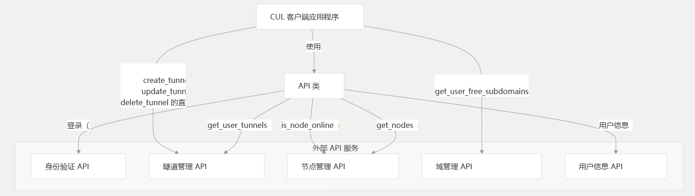
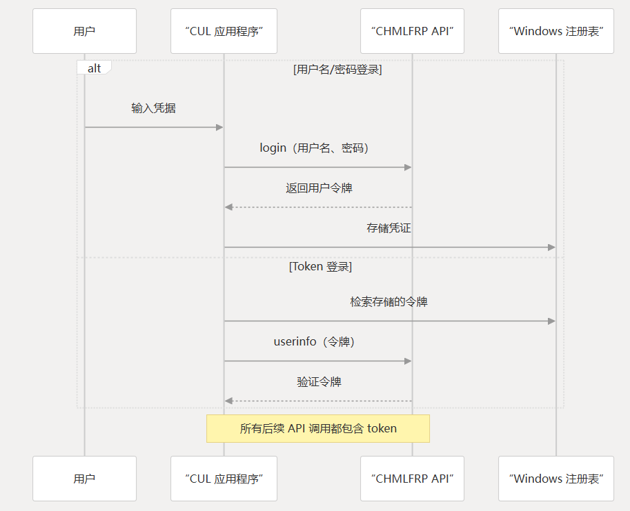

# API 参考
本文档提供了 CHMLFRP_UI 启动器(CUL)  使用的 API 交互的全面参考。

它详细介绍了应用程序如何与 CHMLFRP 后端服务通信，包括身份验证、隧道管理、节点作和域处理。

有关应用程序核心功能的信息，请参阅 核心应用程序。

## API 概述
CUL 应用程序主要通过类与 ChmlFrp 的后端服务通信，该类封装了所有远程 API 调用。

该应用程序使用两个 API 版本：API
- V2 API - 应用程序使用的主要 API（基 URL：`cf-v2.uapis.cn`)
- V1 API - 用于与某些作兼容的旧版 API



## 认证
该应用程序支持两种身份验证方法：

- 用户名/密码身份验证 - 使用凭证直接登录
- 基于令牌的身份验证 - 使用以前获取的令牌

身份验证凭据安全地存储在 Windows 注册表中的 。`HKEY_CURRENT_USER\SOFTWARE\ChmlFrp`



### 身份验证端点

| 端点        | 方法  | 描述        | 参数     |
|-----------|-----|-----------|--------|
| /login    | GET | 对用户进行身份验证 | 用户名、密码 |
| /userinfo | GET | 获取用户信息    | 令牌     |

## API 类实现

该类提供了用于与 CHMLFRP-API 服务交互的静态方法。它处理请求形成、错误处理和响应解析。

### 关键 API 方法

| 方法                                  | 目的        | 参数                      | 返回值                |
|-------------------------------------|-----------|-------------------------|--------------------|
| login(username, password)           | 对用户进行身份验证 | 用户名、密码                  | 带有 token 的 JSON 响应 |
| get_nodes(max_retries, retry_delay) | 检索可用节点    | max_retries、retry_delay | 节点对象列表             |
| is_node_online(node_name, tyen)     | 检查节点状态    | node_name,tyen          | 布尔值或状态对象           |
| get_user_tunnels(user_token)        | 获取用户的隧道   | user_token              | 隧道对象列表             |
| userinfo(user_token)                | 获取用户信息    | user_token              | 用户配置文件对象           |

### 通用标头

应用程序通过以下函数对 API 请求使用标准化标头：

```
def get_headers(request_json=False):
    headers = {'User-Agent': USER_AGENT}
    if request_json:
        headers['Content-Type'] = 'application/json'
    return headers
```
### 隧道管理 API
隧道管理是应用程序的核心功能，允许用户创建、编辑、启动、停止和删除隧道。

| 端点              | 方法   | 描述      | 关键参数                                     |
|-----------------|------|---------|------------------------------------------|
| /tunnel         | GET  | 获取用户的隧道 | 令牌                                       |
| /create\_tunnel | POST | 创建新隧道   | token、tunnelname、node、localip、porttype 等 |
| /update\_tunnel | POST | 更新隧道    | token、tunnelid、tunnelname 等              |
| /deletetunnel   | POST | 删除隧道    | token、tunnelid                           |

### 节点管理 API
该应用程序与节点管理 API 交互以检索节点信息、状态和性能指标。

**节点终端节点**

 | 端点            | 方法   | 描述         | 参数       |
 |---------------|------|------------|----------|
 | /node         | POST | 获取所有节点     | 无        |
 | /node\_stats  | GET  | 获取节点状态     | 无        |
 | /nodeinfo     | GET  | 获取特定节点信息   | token，节点 |
 | /node\_uptime | GET  | 获取节点正常运行时间 | 时间、节点    |

### 域管理 API

域管理 API 允许用户查看、创建和管理与其隧道关联的域记录。

**域终端节点**

| 端点                           | 方法  | 描述       | 参数 |
|------------------------------|-----|----------|----|
| /get\_user\_free\_subdomains | GET | 获取用户的域   | 令牌 |
| /list\_available\_domains    | GET | 列出可用的域后缀 | 无  |


## API 速率限制和轮询
该应用程序为节点状态和其他实时信息实现了各种轮询机制：

| 操作     | 轮询间隔  | 目的             |
|--------|-------|----------------|
| 更新检查器  | 40 秒  | 检查应用程序更新       |
| 节点状态   | 10 分钟 | 检查隧道故障转移的节点状态  |
| 域检查    | 10 分钟 | 验证域到节点的映射      |
| API 状态 | 30 秒  | 更新 API 服务器状态显示 |

该应用程序包括具有指数回退的重试机制，用于处理速率限制或 API 临时不可用。