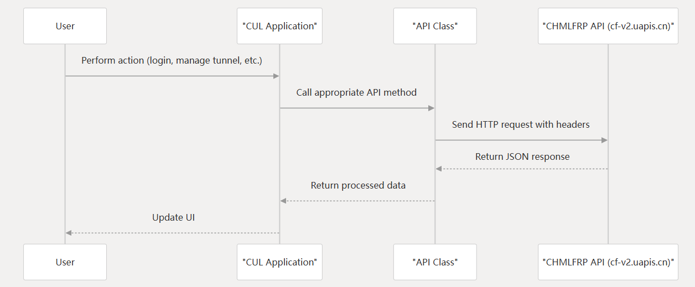
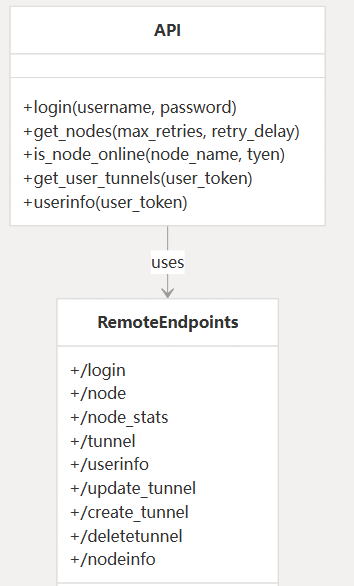
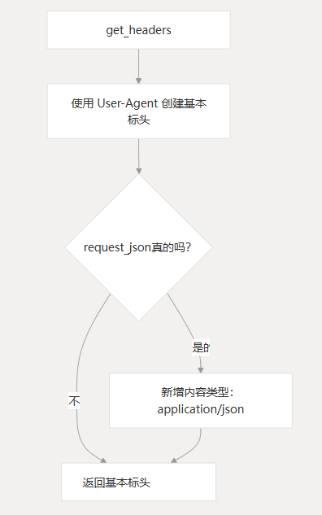
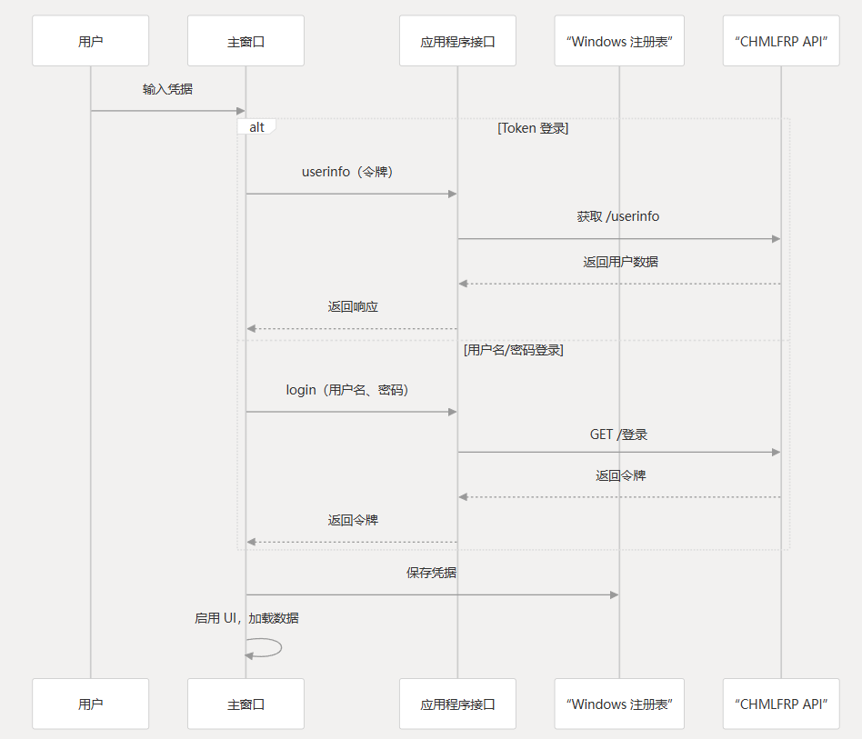
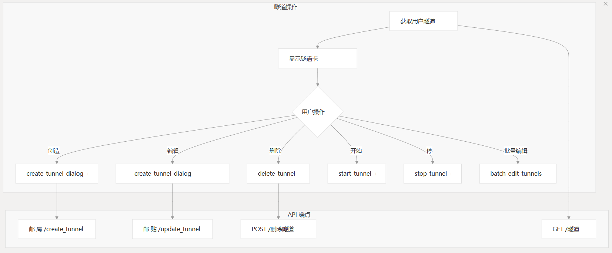
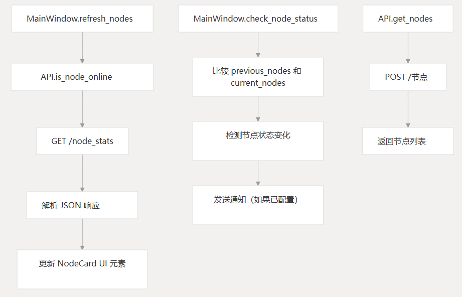
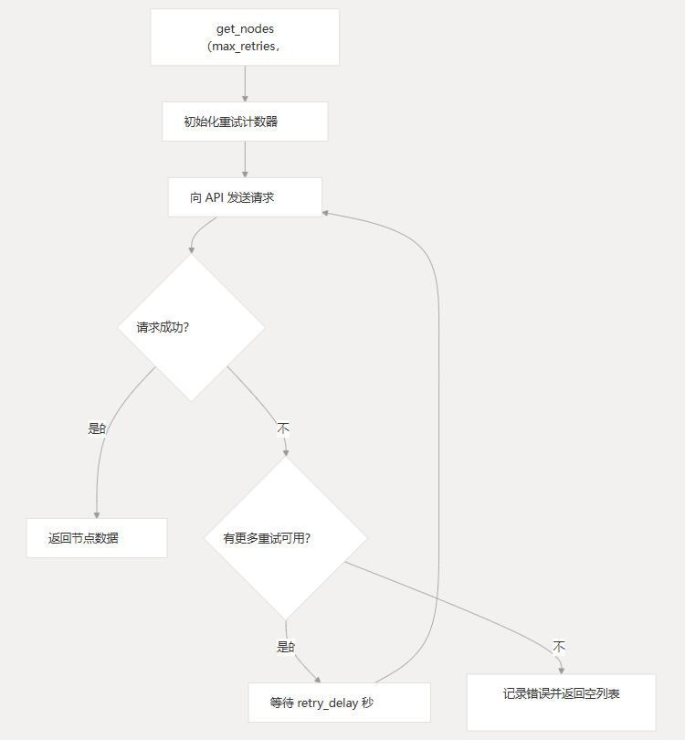
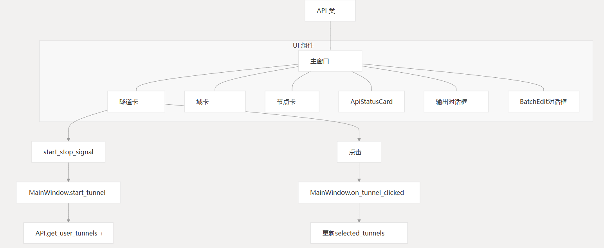
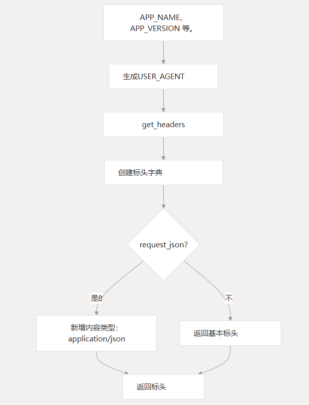

# API 集成

### 目的和范围

本文档介绍了 CHMLFRP UI 启动器(CUL)的 API 集成组件，这些组件支持客户端应用程序和 CHMLFRP 后端服务之间的通信。

API 集成层处理身份验证、隧道管理、域配置、节点状态监控和用户信息检索。

有关 Tunnel 进程管理的信息，请参阅 Tunnel 管理。有关配置处理，请参阅设置和配置。

## API 架构概述

CUL 应用程序使用 HTTP 请求与托管在 `cf-v2.uapis.cn` 上的 CHMLFRP API 服务进行通信。

API 集成主要通过 `API` 类处理，该类为不同的 API 端点提供方法。

这些方法在整个应用程序中用于获取数据、提交更改和对用户进行身份验证。



## API 方法和端点

API 类提供了与 CHMLFRP-API 服务器上的不同端点相对应的方法：



## API 类实现

该类用作与 CHMLFRP API 通信的主接口。它被实现为具有静态方法的类，每个方法处理特定的 API 操作。

| 方法                 | 端点            | HTTP 方法 | 目的                |
|--------------------|---------------|---------|-------------------|
| `login`            | `/login`      | GET     | 使用用户名/密码对用户进行身份验证 |
| `get_nodes`        | `/node`       | POST    | 使用重试机制检索节点列表      |
| `is_node_online`   | `/node_stats` | GET     | 检查特定节点是否在线        |
| `get_user_tunnels` | `/tunnel`     | GET     | 检索用户的隧道列表         |
| `userinfo`         | `/userinfo`   | GET     | 获取用户配置文件信息        |

## API 标头

对 API 的所有请求都包含一组标准化的标头，由 `get_headers` 函数管理：



标头由全局变量 `USER_AGENT` 构成，包括应用程序名称、版本、Python 版本和 Windows 版本。

## 身份验证流程

CUL 中的身份验证通过用户名/密码登录或直接令牌身份验证进行。身份验证流由 `MainWindow` 和 `API` 类协调处理。



身份验证流程：
1. 用户输入凭据（用户名/密码或令牌）。
2. 调用 `API.login` 或 `API.userinfo` 方法。
3. 验证成功后，将用户数据或令牌返回到应用程序。
4. 凭证存储在 Windows 注册表中，以便在应用程序重新启动时进行持久登录。

存储位置：`HKEY_CURRENT_USER\SOFTWARE\ChmlFrp`

## 隧道管理 API

隧道管理是应用程序的核心功能，允许用户创建、更新和删除隧道。

### 隧道数据结构

隧道由具有以下关键属性的 JSON 对象表示：

| 属性            | 描述                       |
|---------------|--------------------------|
| `id`          | 唯一标识符                    |
| `name`        | 显示名称                     |
| `node`        | 节点服务器名称                  |
| `type`        | 协议类型（tcp、udp、http、https） |
| `localip`     | 要转发的本地 IP/主机名            |
| `local_port`  | 本地端口号                    |
| `remote_port` | 远程端口或域名                  |
| `encryption`  | 是否启用加密                   |
| `compression` | 是否启用压缩                   |

### 隧道管理流程



## 域管理 API

该应用程序允许用户管理 HTTP/HTTPS 隧道的域注册。

### 域数据结构

域记录具有以下关键属性：

| 属性        | 描述             |
|-----------|----------------|
| `domain`  | 主域             |
| `record`  | 子域记录           |
| `type`    | 记录类型（例如 CNAME） |
| `target`  | 目标终端节点         |
| `ttl`     | 生存时间值          |
| `remarks` | 可选注释           |

### 域 API 端点

- `/get_user_free_subdomains`：检索用户的域记录
- `/list_available_domains`：列出可注册的域
- 域更新终端节点（用于备份节点配置）

## 节点状态监控

该应用程序监控节点状态以确定隧道的可用性并向用户提供显示信息。

### 节点数据结构

节点数据包括：

| 属性                | 描述         |
|-------------------|------------|
| `node_name`       | 节点标识符      |
| `state`           | 在线/离线状态    |
| `nodegroup`       | 节点分类组      |
| `cpu_usage`       | CPU 利用率百分比 |
| `bandwidth_usage` | 带宽使用情况     |

### 节点状态 API 流程


1. `MainWindow.refresh_nodes()` 调用 `API.get_nodes()`。
2. 发送 `POST /node` 请求。
3. 解析 JSON 响应并更新 `NodeCard` UI 元素。
4. 比较前后节点状态，检测变化并发送通知（如果配置了通知）。

## 错误处理和重试

API 集成实现了强大的错误处理和重试机制，以处理网络问题和 API 故障。

### 重试机制



以 `get_nodes` 方法为例：
1. 初始化重试计数器。
2. 发送请求到 API。
3. 如果请求成功，返回节点数据。
4. 如果失败且仍有重试次数，则等待指定时间后重试。
5. 如果重试次数耗尽，则记录错误并返回空列表。

### 错误处理模式

- **异常捕获**：所有 API 方法都使用 `try-except` 块来捕获和记录异常。
- **回退值**：方法在失败时返回空列表或 `None`。
- **HTTP 状态检查**：验证响应状态代码。
- **JSON 验证**：在处理之前验证响应数据。
- **日志记录**：记录错误以进行调试。

### 错误处理示例

```
try:
    response = requests.get(url, headers=headers, params=params)
    response.raise_for_status()
    data = response.json()
    if data['code'] == 200:
        tunnels = data.get("data", [])
        return tunnels
    else:
        logger.error(f"Error: {data.get('msg')}")
        return []
except requests.RequestException:
    logger.exception("Network error occurred while fetching tunnel list")
    return []
except Exception:
    logger.exception("Unknown error occurred while fetching tunnel list")
    return []
```

## API 与 UI 组件集成
API 集成与多个 UI 组件连接以显示和管理数据：



## API 响应处理
API 响应遵循一致的 JSON 结构：
```
{
    "code": 200,           // 状态码（200 = 成功）
    "msg": "...",          // 消息（成功时通常为空）
    "data": ["..."]          // 包含响应数据的数组或对象
}
```
应用程序在处理响应时会检查 code 和 msg，并将错误消息记录或显示给用户。

## 配置和标头
API 请求包括用于标识和内容类型的特定标头：



## 总结
CHMLFRP UI 启动器中的 API 集成层为 CHMLFRP API 服务提供结构化接口。

它使用适当的错误处理和重试机制处理身份验证、数据检索和管理操作。

API 类充当所有远程通信的中心点，为请求格式和响应处理保持一致的模式。

API 集成的关键方面包括：
- 
- 带有 User-Agent 标识的标准请求标头
- JSON 请求/响应处理
- 错误捕获和适当的回退
- 与 UI 组件集成以进行数据显示
- 用于身份验证的凭据管理
- 暂时性故障的重试逻辑

API 集成支持应用程序的核心功能，允许用户通过图形界面管理隧道、域和监控节点状态。

