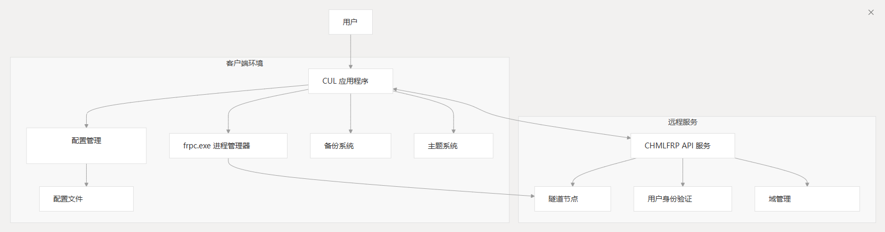
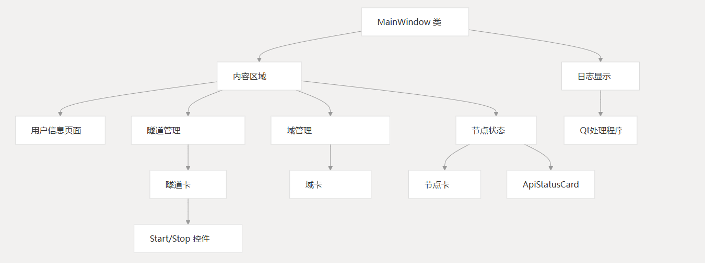
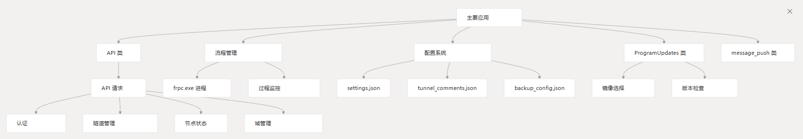
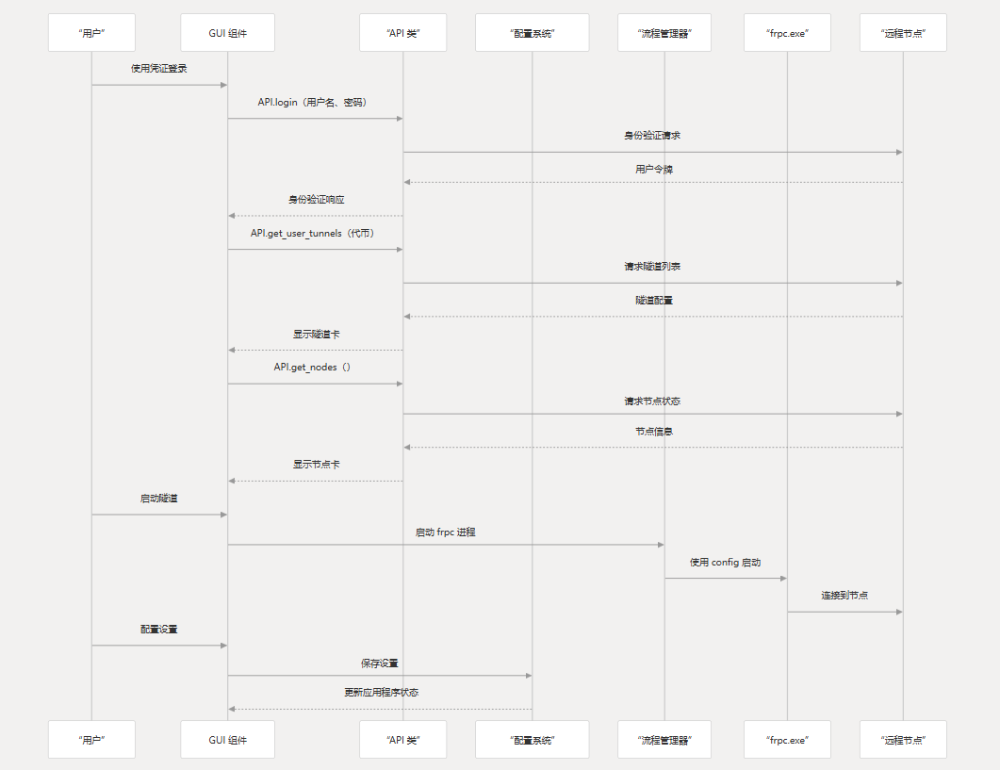
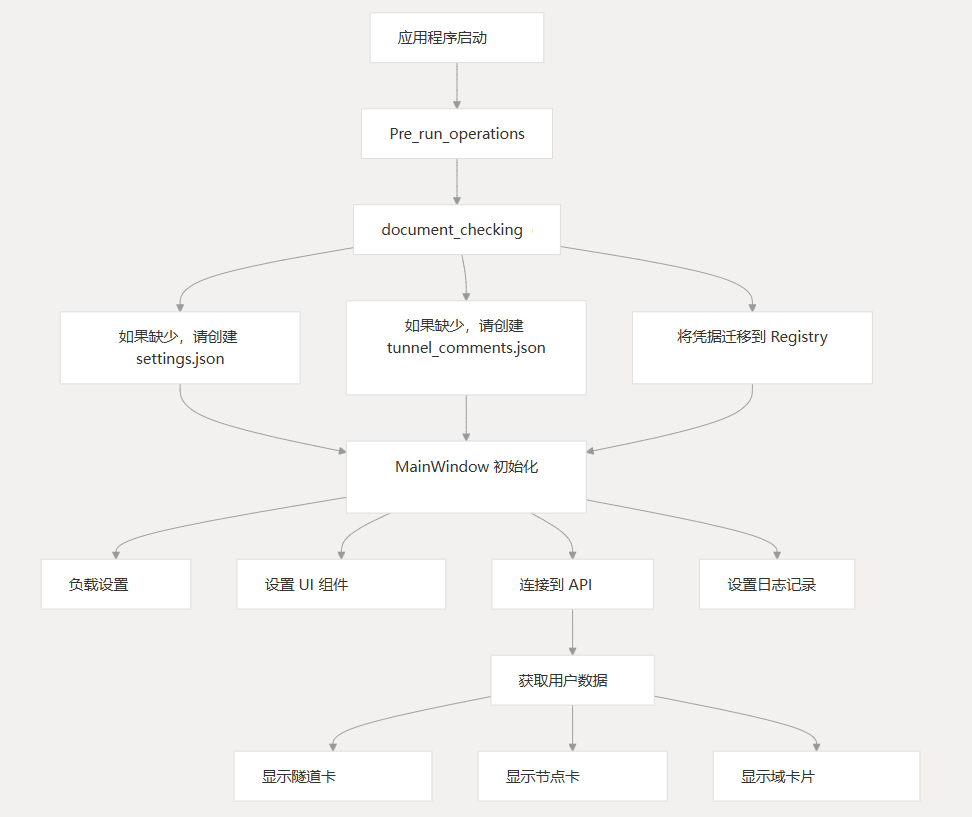

## 系统架构

CUL 应用程序遵循模块化架构，用户界面、API 通信和流程管理组件之间有明确的分离。



## 主要组件

该应用程序由几个关键组件组成，这些组件协同工作以提供其功能：

### 用户界面组件



### 核心系统组件



## 数据流

下图说明了数据如何流经系统：



## 核心功能

CUL 应用程序提供以下主要功能：

### 用户身份验证和管理
用户可以使用其 CHMLFRP 凭证进行身份验证，然后使用这些凭证检索其隧道配置、节点访问和域信息。

### 隧道管理
用户可以查看、启动、停止和配置其隧道。每个隧道在 UI 中都显示为一张卡片，显示其状态、连接详细信息和控件。

| 特征    | 描述         |
|-------|------------|
| 开始/停止 | 控制单个隧道作业   |
| 批量编辑  | 同时编辑多个隧道   |
| 评论    | 向隧道添加自定义注释 |
| 备份配置  | 为隧道配置备份节点  |
| 自动启动  | 将隧道设置为自动启动 |

### 节点状态监控
该应用程序显示可用 CHMLFRP 节点的状态，包括其在线状态、性能指标和其他详细信息。

### 域管理
用户可以查看和管理他们的 CHMLFRP 域，这些域可以与 HTTP/HTTPS 隧道一起使用。

### 配置系统
该应用程序使用多个配置文件来存储用户首选项、隧道注释和备份配置。

| 文件                   | 目的           |
|----------------------|--------------|
| settings.json        | 存储应用程序设置和首选项 |
| tunnel_comments.json | 存储用户定义的隧道注释  |
| backup_config.json   | 存储备份节点配置     |

### 更新系统
该应用程序可以检查更新，自动下载和安装它们。

### 通知系统
该应用程序可以针对各种事件发送电子邮件通知，例如隧道状态更改和节点状态更新。

## 技术实现

CUL 应用程序是使用 PyQt6 构建的，并使用了几种关键技术：

| 技术               | 目的             |
|------------------|----------------|
| PyQt6            | GUI 框架         |
| Requests         | HTTP API 通信    |
| Python threading | 异步操作           |
| JSON             | 配置文件格式         |
| Windows Registry | 凭据存储           |
| subprocess       | 管理 frpc.exe 流程 |

## 系统要求

CUL 应用程序专为 Windows 10 及更高版本而设计，需要 Python 3.13.* 进行开发，但作为独立可执行文件分发。

## 组件初始化过程



## 配置文件架构

### settings.json
```json
{
  "auto_start_tunnels": [],
  "theme": "light",
  "log_size_mb": 10,
  "backup_count": 30,
  "mail": {
    "sender_email": "",
    "password": "",
    "smtp_server": "",
    "smtp_port": "",
    "notifications": {
      "tunnel_offline": false,
      "node_offline": false,
      "tunnel_start": false,
      "node_online": false,
      "node_added": false,
      "node_removed": false
    }
  }
}
```
### tunnel_comments.json
```json
{
  "tunnel_id_1": "User comment for tunnel 1",
  "tunnel_id_2": "User comment for tunnel 2"
}
```
## 系统集成
CUL 应用程序与 CHMLFRP API 服务 （`cf-v2.uapis.cn`） 集成以提供隧道管理功能。

它还管理 frpc.exe 进程，该进程负责建立实际的隧道连接。