# 主要组件

本文档介绍了 CHMLFRP_UI 启动器(CUL)  系统的核心组件及其各自的职责。

它从技术上概述了系统的结构以及不同组件如何相互交互。

有关组件之间数据流的信息，请参阅数据流。

## 组件架构概述
CHMLFRP UI 启动器由几个主要组件组成，这些组件协同工作，为管理 frp 隧道提供统一的界面。

这些组件按分层架构进行组织：

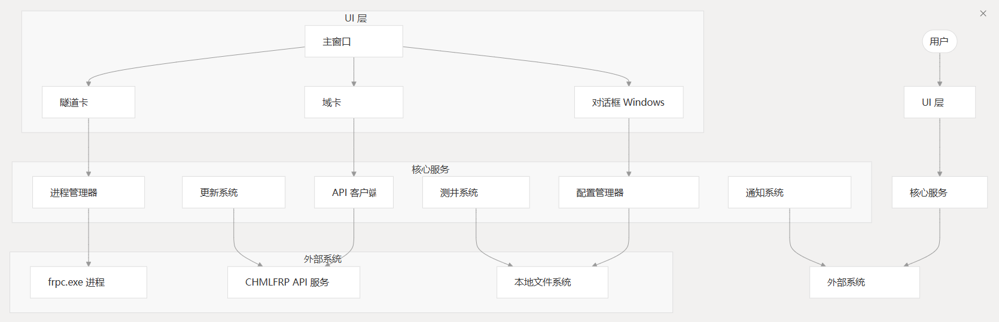

## 核心服务组件
核心服务组件处理应用程序的业务逻辑和外部交互。

### API 客户端
API 客户机组件管理与 CHMLFRP 远程 API 服务的所有通信。

它作为类实现，并提供以下方法：
- 用户身份验证
- 检索隧道配置
- 获取节点信息
- 检查节点状态
- 管理用户信息

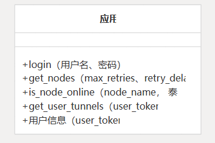

### 流程管理
Process Management 组件负责创建、监控和终止建立实际隧道的frpc.exe进程。

主要功能包括：
- 根据用户配置启动隧道
- 监控正在运行的隧道进程
- 请求时停止隧道
- 清理孤立的进程
- 捕获日志的进程输出

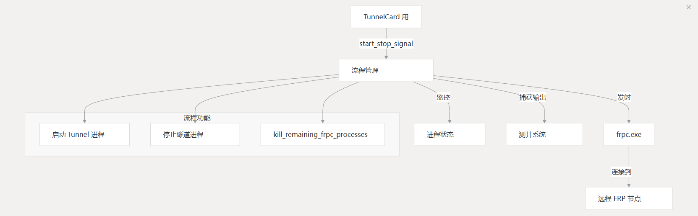

### 配置管理

Configuration Management 组件处理应用程序设置、隧道注释和用户凭证的存储和检索。

它使用 JSON 文件和 Windows 注册表实现持久性。

关键配置文件：
- settings.json - 存储应用程序设置
- tunnel_comments.json - 存储用户定义的隧道注释
- Windows 注册表 - 安全地存储用户凭据
- 
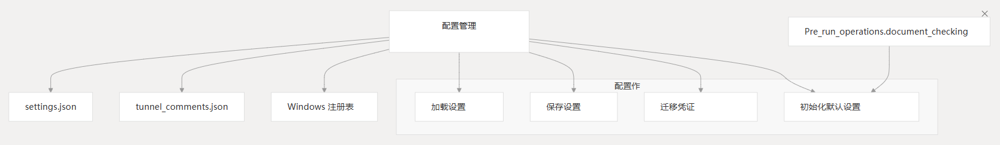

### 更新系统
Update System 检查应用程序的新版本并管理更新过程。它作为类实现。

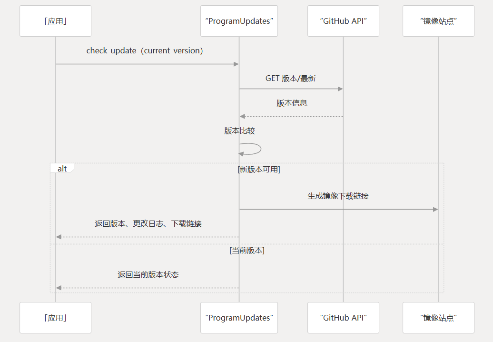

### 通知系统
Notification System 使用该类发送有关系统事件的电子邮件警报。

它支持各种电子邮件提供商和通知类型。

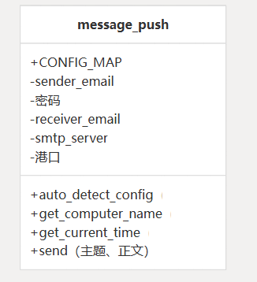

### 日志系统
日志记录系统捕获和管理应用程序日志，将它们定向到 UI 和日志文件。

它使用该类将标准 Python 日志记录与 Qt UI 桥接。

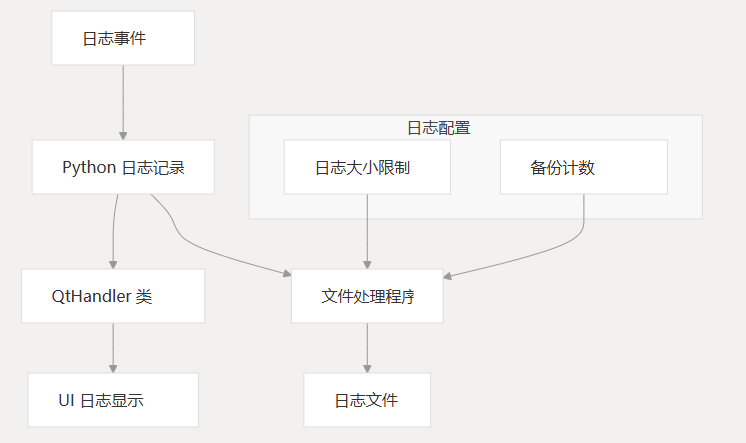

## 用户界面组件
UI 组件为用户提供了与应用程序交互的可视化界面。

### 主窗口和 UI 结构
- 主窗口将 UI 组织为几个关键区域：
- 标题栏
- 用于导航的侧边菜单
- 具有多个页面的内容区域
- 日志显示区域

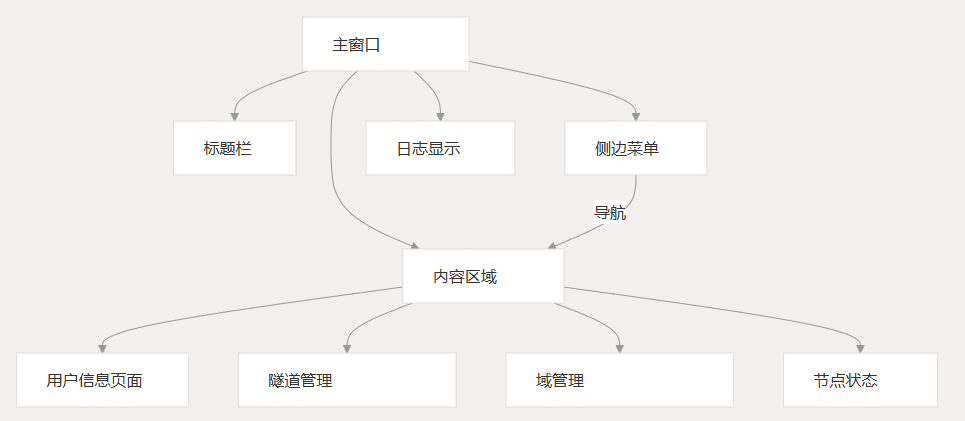

### 隧道卡
该类表示 UI 中的各个隧道。每个卡都显示隧道信息并提供用于管理隧道的控件。

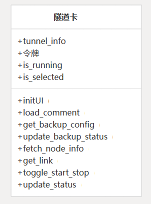

### 域卡
该类表示 UI 中的域配置。每个卡显示域信息并提供指向域的链接。

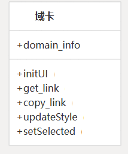

### 对话框
该应用程序包括几个用于特定功能的对话框窗口：

设置对话框 （类）`SettingsDialog`
- 管理应用程序设置
- 处理主题配置
- 配置自动隧道启动
- 管理通知设置

Batch Edit 对话框 （类）`BatchEditDialog`
- 允许一次编辑多个隧道
- 提供节点选择和配置

输出对话框 （类）`OutputDialog`
- 显示隧道进程输出
- 显示用于调试的日志

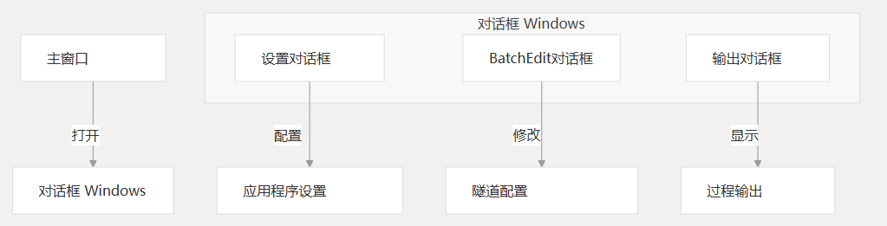

## 实用程序组件
### 数据验证
该类提供了各种数据验证函数来检查 `input` 值。
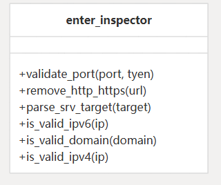

### 初始化和设置
该类处理应用程序初始化任务：`Pre_run_operations`
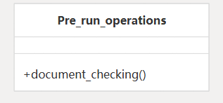

### 组件依赖关系和交互
下图说明了主要组件之间的关键依赖关系和交互：
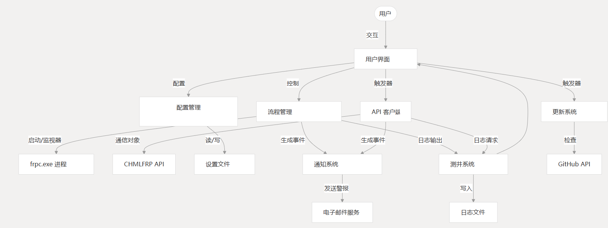

### 组件职责摘要
| 元件             | 主类/函数                 | 责任                      |
|----------------|-----------------------|-------------------------|
| API 客户端        | API类                  | 处理与 CHMLFRP API 服务的所有通信 |
| 流程管理           | 功能多样                  | 管理隧道的 frpc.exe 流程       |
| 配置管理           | Pre\_run\_operations类 | 处理设置和配置文件               |
| 更新系统           | ProgramUpdates类       | 检查并促进软件更新               |
| 通知系统           | message\_push类        | 发送事件的电子邮件通知             |
| 测井系统           | QtHandler类            | 管理应用程序日志记录              |
| 隧道卡            | TunnelCard类           | 隧道的 UI 表示               |
| 域卡             | DomainCard类           | 域的 UI 表示                |
| 设置 对话框         | SettingsDialog类       | 用于配置应用程序的接口             |
| Batch Edit 对话框 | BatchEditDialog类      | 用于编辑多个隧道的接口             |
| 输出对话框          | OutputDialog类         | 显示流程输出                  |
| 数据验证           | enter\_inspector类     | 验证用户输入                  |

