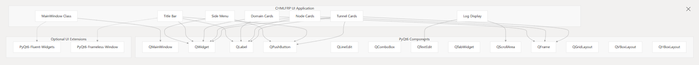
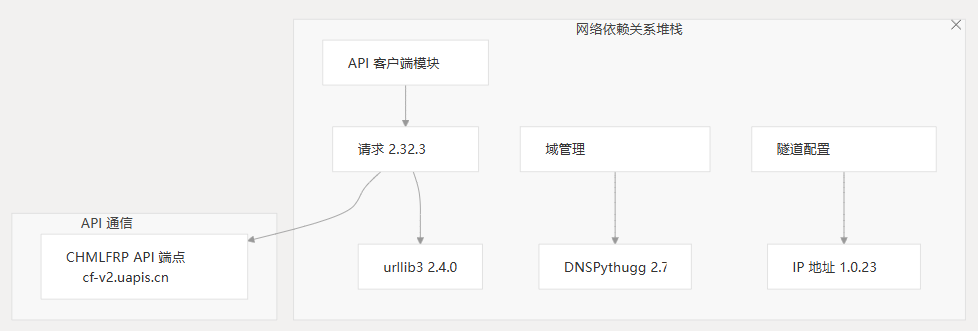

# 依赖

本页记录了 CHMLFRP_UI 启动器(CUL)应用程序所需的依赖项。它涵盖了开发和生产环境所需的 Python 包、UI 框架和运行时依赖项。

有关构建管道的信息，请参阅构建管道，有关分发的详细信息，请参阅分发。

## 依赖项概述

CHMLFRP UI Launcher 依赖于几个关键依赖项来提供其功能。

这些依赖项可以分为核心 Python 包、UI 框架组件和运行时依赖项。

- CHMLFRP UI Launcher Dependencies
- Optional UI Components
- Runtime Dependencies
- Python Packages
- PyQt6-Fluent-Widgets
- CHMLFRP UI Launcher
- PyQt6 - UI Framework
- requests - HTTP Client
- ipaddress - IP Handling
- psutil - Process Management
- pyperclip - Clipboard Access
- Markdown - Text Processing
- urllib3 - HTTP Library
- dnspython - DNS Toolkit
- frpc.exe - FRP Client
- Windows OS
- PyQt6-Frameless-Window

## 核心 Python 依赖项

该应用程序依赖于以下 Python 包，如 requirements.txt 文件中所述：

| 包         | 版本     | 目的                  |
|-----------|--------|---------------------|
| PyQt6     | 6.9.0  | 桌面应用程序的主 UI 框架      |
| requests  | 2.32.3 | 用于 API 通信的 HTTP 客户端 |
| urllib3   | 2.4.0  | 请求使用的 HTTP 库        |
| ipaddress | 1.0.23 | IP 地址作和验证           |
| psutil    | 7.0.0  | 流程管理和系统监控           |
| pyperclip | 1.9.0  | 跨平台剪贴板功能            |
| Markdown  | 3.7    | Markdown 文本处理       |
| dnspython | 2.7.0  | 用于域验证和查询的 DNS 工具包   |

这些依赖项构成了应用程序功能的基础，每个依赖项在系统体系结构中都有特定的用途。

## UI 框架依赖项

该应用程序使用 PyQt6 作为其主要 UI 框架。应用程序和 PyQt6 组件之间的关系如下所示：



## 其他 UI 组件

应用程序可以选择使用以下 UI 扩展：

- PyQt6-Fluent-Widgets：为 PyQt6 提供一组 Fluent 设计小部件
- PyQt6-Frameless-Window：启用无框窗口功能以实现现代 UI 外观

这些组件在项目的开发说明中引用，但未在核心 requirements.txt 文件中列出，这表明它们可能是可选的或在特定的开发场景中使用。

## 网络依赖关系堆栈



## 系统集成依赖项

该应用程序依赖 **psutil** （版本 7.0.0） 进行进程管理，特别是用于控制和监视建立实际隧道的进程。它还将 **pyperclip** （版本 1.9.0） 用于剪贴板功能，允许用户轻松复制隧道详细信息、日志或配置片段。

## 运行时依赖项

除了 Python 包之外，该应用程序还需要：

- frpc.exe：FRP（快速反向代理）的客户端可执行文件，用于建立到远程节点的实际隧道
- Windows 操作系统：该应用程序主要是为 Windows 环境构建的

## 依赖关系管理

依赖项通过标准的 Python 包管理工具进行管理：
```
# Install dependencies from requirements.txt
pip install -r requirements.txt

# Alternative: Install with a specific mirror source (example from pipv.py)
pip install -r requirements.txt -i http://mirrors.aliyun.com/pypi/simple/
```
开发说明中提到的镜像源包括 Aliyun 的 PyPI 镜像 `http://mirrors.aliyun.com/pypi/simple/`

## 版本约束

应用程序在其 requirements.txt 文件中为所有依赖项指定确切版本，这有助于确保开发和生产环境之间的一致性。

在构建或部署应用程序时，请务必维护这些版本约束以避免兼容性问题。

| 类别   | 主要依赖项                                   | 次要依赖项                                            |
|------|-----------------------------------------|--------------------------------------------------|
| 用户界面 | PyQt6 版本 6.9.0                          | （可选）PyQt6-Fluent-Widgets, PyQt6-Frameless-Window |
| 联网   | 请求 2.32.3、urllib3 2.4.0、dnspython 2.7.0 | IP 地址 1.0.23                                     |
| 系统   | psutil 7.0.0、pyperclip 1.9.0            | -                                                |
| 文本处理 | Markdown 3.7 版                          | -                                                |

## 开发与生产依赖关系

requirements.txt 中列出的核心依赖项对于开发和生产环境都是必需的。但是，在开发过程中，其他工具可能会有所帮助：

- 包管理工具：`pipv.py` 中记录了用于管理包的命令，包括安装、升级和卸载过程
- 镜像源：替代 PyPI 镜像，可在特定区域更快地下载软件包

出于构建和分发目的，GitHub Actions 工作流需要与 Nuitka 和编译工具相关的其他依赖项，这些依赖项在 Build Pipeline 部分中进行了介绍。