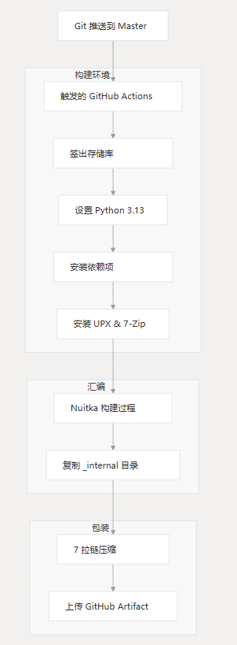

# 分配

## 相关源文件

本文档概述了如何打包 CHMLFRP_UI_Launcher (CUL) 并将其分发给最终用户。

它涵盖了独立应用程序的构建过程、打包方法和分发渠道。

有关构建管道配置的信息，请参阅构建管道。

有关应用程序依赖项的详细信息，请参阅依赖项。

## 分发概述

CUL 项目使用标准化的分发过程，将 Python 源代码转换为独立的 Windows 可执行应用程序，无需用户安装 Python 或依赖项。

## 构建和打包过程

该应用程序是使用 GitHub Actions 和 Nuitka 构建的，用于创建独立的可执行文件。

当代码推送到 master 分支或发出拉取请求时，会自动触发此过程。

## Nuitka 构建配置

Nuitka 构建使用特定参数来确保所有组件都包含在最终可执行文件中：

| 选择                             | 目的                |
|--------------------------------|-------------------|
| --standalone                   | 创建独立的应用程序包        |
| --python-flag=-O               | 应用 Python 优化      |
| --include-data-files           | 添加所需的资源（图标、可执行文件） |
| --include-package=PyQt6        | 捆绑 PyQt6 模块       |
| --upx-binary                   | 启用 UPX 压缩         |
| --windows-console-mode=disable | 在运行时隐藏控制台窗口       |
| --windows-icon-from-ico        | 设置应用程序图标          |

## 资源包含

构建过程包括几个关键文件：

- favicon.ico 和 favicon-d.ico - 应用程序图标
- CUL_update.exe - 更新实用程序
- frpc.exe - Core FRP 客户端可执行文件
- PyQt6 依赖项和插件

## 包结构

最终的分发包是一个 ZIP 存档，其中包含独立可执行文件和所有必需的资源。

CHMLFRP_UI_YYYY_MM_DD.zip

- build_output/
  - CHMLFRP_UI.dist/
    - CHMLFRP_UI.exe
    - Resource Files
    - PyQt6 Components
    - _internal/ Directory
    - Dependency Libraries
      - favicon.ico
      - favicon-d.ico
      - frpc.exe
      - CUL_update.exe
      - styles/
      - platforms/
      - qml/
      - Qt6Core.dll
      - Qt6Gui.dll
      - Qt6Widgets.dll
      - requests/
      - psutil/
      - Other dependencies

## 工件生成

构建过程会生成格式为 `CHMLFRP_UI_YYYY_MM_DD.zip` 的文件。

此命名约定有助于跟踪应用程序的不同版本。

压缩过程使用以下 7-Zip 参数来获得最佳文件大小：

- 最大压缩级别 （-mx=9)
- 已启用多线程 （-mmt=on)
- 273 个快速字节 （-mfb=273)
- 15 次通行证 （-mpass=15)

构件在构建后存储在 GitHub Actions 上 7 天，允许在公开分发之前进行下载和测试。

## 分销渠道

成功构建和测试后，将通过以下渠道手动分发应用程序：

### 初级分发

- 蓝邹云：[https://cul.lanzoul.com/b00pzv3oyj](https://cul.lanzoul.com/b00pzv3oyj) （密码：ff50）
- 项目网址：[https://cul.chmlfrp.com](https://cul.chmlfrp.com)

## 安装说明

安装过程很简单：

1. 从分发渠道下载 ZIP 存档
2. 将内容提取到任何位置
3. 直接运行 CHMLFRP_UI.exe

不需要传统安装，因为该应用程序是完全独立的。

## 系统要求

| 要求   | 详情               |
|------|------------------|
| 操作系统 | Windows 10 或更高版本 |
| 架构   | x64 （64 位）       |
| 其他软件 | 无（包括所有依赖项）       |

## 更新机制

该应用程序包括 `CUL_update.exe`，它似乎用于处理软件更新。更新过程可能会根据已安装的版本检查分发的软件包版本，并在更新可用时促进应用程序文件的替换。

## 分发工作流程

从开发到最终用户的完整分发工作流程如下所示：

