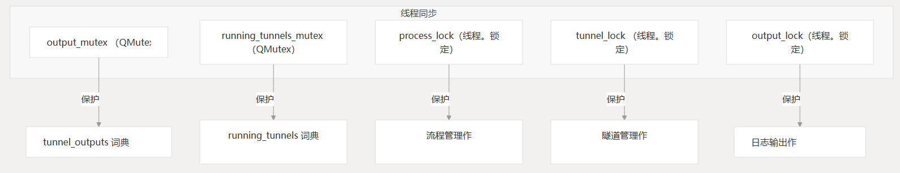

# 后台进程

本文档提供了 CHMLFRP-UI-Launcher (CUL) 中使用的后台进程的技术概述。

后台进程包括与主应用程序线程并发运行的所有作，例如计时器、工作线程和外部进程管理。

有关整个应用程序体系结构的信息，请参阅体系结构概述。

## 1. 后台进程的类型

CUL 应用程序使用多种类型的后台进程来处理不应阻止主 UI 线程的作：

- 基于计时器的定期任务 - 计划定期运行的作
- 工作线程 - 用于 CPU 密集型或阻塞作的专用线程
- 外部进程管理 - 监视和控制进程 frpc.exe
- 异步通知 - 电子邮件警报的后台传递

## 2. 基于计时器的后台任务

该应用程序使用多个 QTimer 实例来执行常规作，而不会阻塞主 UI 线程。

### 2.1 自动更新定时器

每 40 秒检查一次应用程序更新和节点状态：

### 2.2 隧道检查计时器

每 10 分钟监控一次隧道状态并管理到备份节点的故障转移：

### 2.3 API 状态刷新定时器

ApiStatusCard 类实现了一个 30 秒的刷新计时器来更新 API 服务器状态信息：

### 2.4 本地更新检查器计时器

UpdateCheckerDialog 使用 1 秒计时器扫描本地下载的更新包：

## 3. 用于后台作的工作线程

该应用程序使用 QThread 和自定义工作线程对象来执行作，否则这些作会阻止 UI 线程。

### 3.1 更新检查器 Worker 线程

线程在检查应用程序更新时启动：

### 3.2 镜像刷新 Worker 线程

与更新检查器类似，此 worker 线程在后台线程中刷新镜像服务器列表：

### 3.3 电子邮件通知线程

应用程序在单独的守护程序线程中发送电子邮件通知，以避免阻塞 UI：

## 4. 外部流程管理

应用程序管理进程，这些进程是处理实际隧道的外部可执行文件：`frpc.exe`

### 4.1 进程清理功能

该应用程序包括一个实用程序函数，可在需要时强制终止任何剩余进程：`frpc.exe`

## 5. 线程同步机制

为了确保线程安全，应用程序使用了多种互斥锁和锁定机制：

这些同步原语在方法中初始化：`MainWindow.__init__`

## 6. 日志记录和事件处理

该应用程序使用自定义日志记录处理程序，该处理程序在生成新的日志记录时发出信号，从而允许在 UI 中显示日志消息：`QtHandler`

signal-slot 连接确保日志更新发生在主线程中：

## 7. 节点状态监控

该应用程序会定期检查 FRP 节点的状态，并在需要时处理到备份节点的故障转移：

## 8. 应用程序退出时清理后台进程

当应用程序关闭时，它会正确清理所有后台进程：

## 9. 完整的后台进程架构

下图显示了 CHMLFRP-UI-Launcher 中后台进程的整体架构：

此体系结构可确保在单独的线程或进程中处理可能长时间运行或阻止的作，从而在保持 UI 响应能力的同时仍执行所有必要的后台任务。