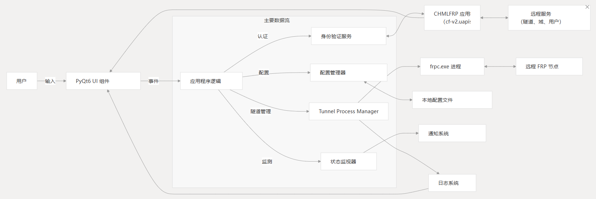
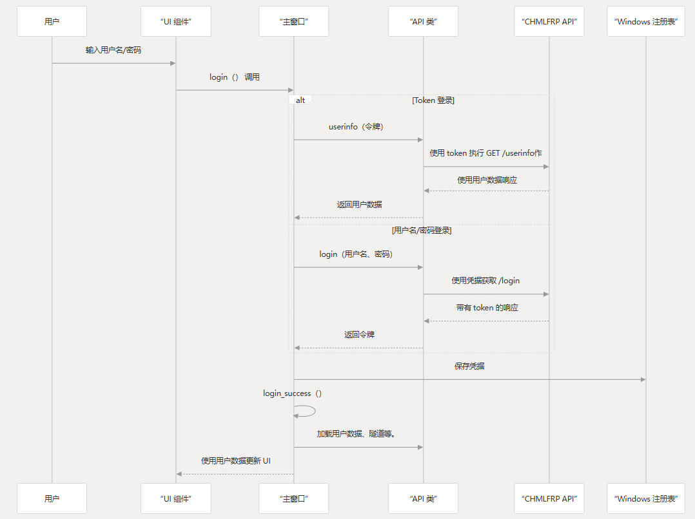
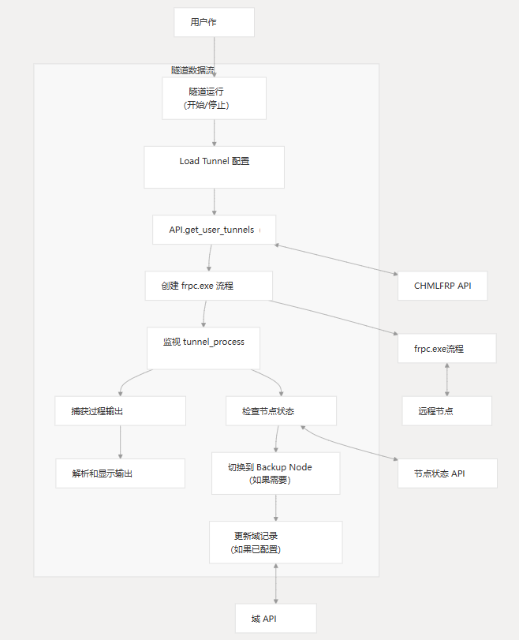
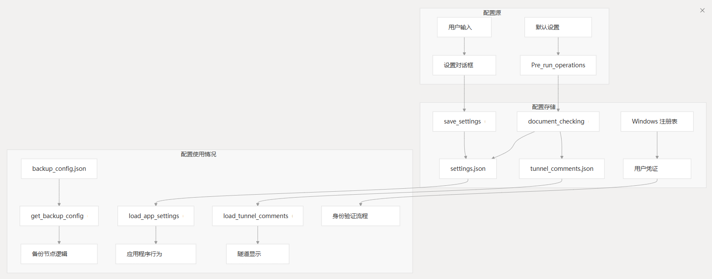
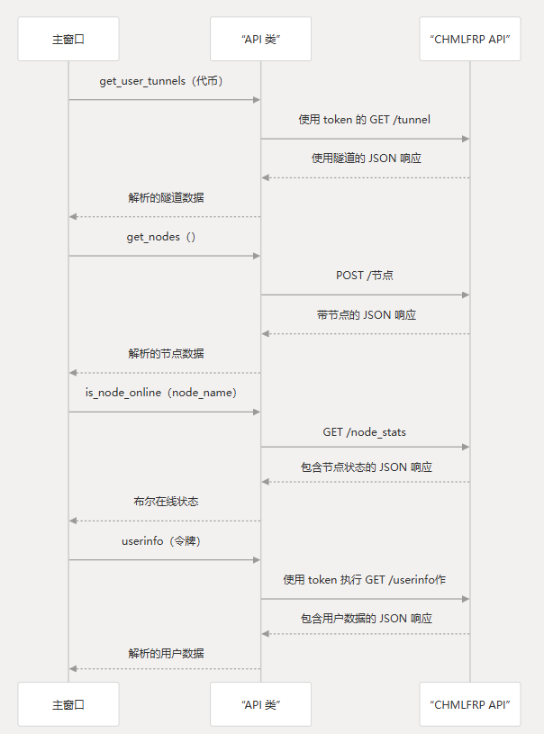
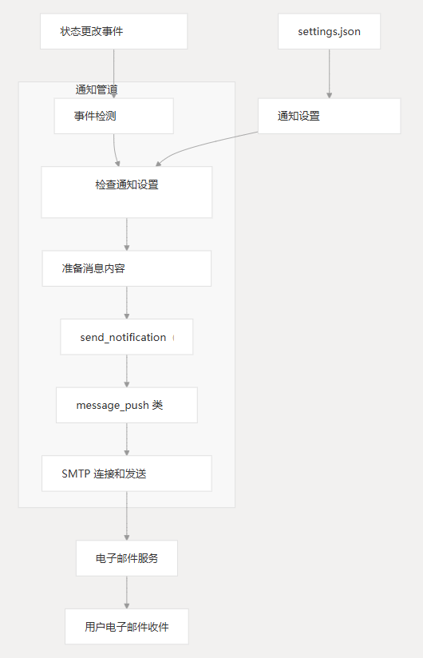
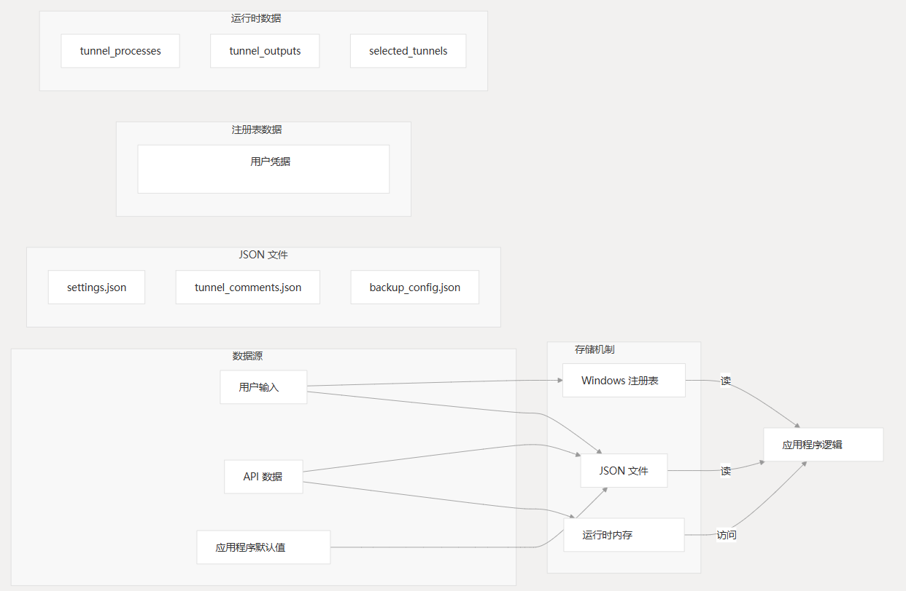
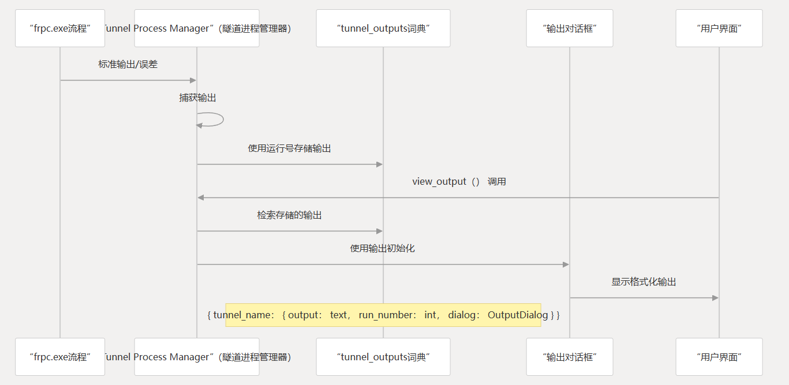
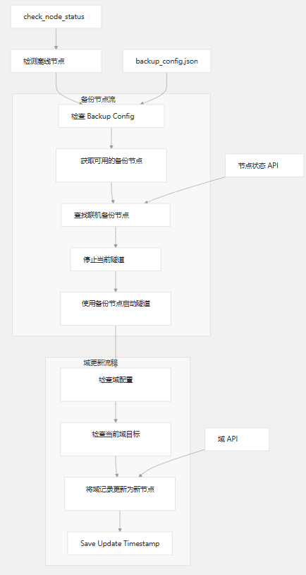

# 数据流

本页记录了数据如何流经 CHMLFRP-UI-Launcher 系统，详细介绍了从用户输入到程序组件到外部服务再返回的信息路径。

重点是启用启动器核心功能的主要数据路径，包括用户身份验证、隧道管理、API 通信和配置处理。

有关主要架构组件的具体信息，请参阅[主要组件](#主要组件)。

有关后台进程的详细信息，请参阅[后台进程](#后台进程)。

## 系统数据流概述

CHMLFRP-UI-Launcher 作为客户端应用程序运行，它通过 FRP 隧道管理本地服务和远程 CHMLFRP 服务器之间的连接。

下图说明了整个系统中的高级数据流：



## 身份验证数据流

当用户与系统交互时，第一个数据流涉及身份验证，以与 CHMLFRP API 建立会话：



### 关键组件及其角色

| 组件                   | 角色           | 处理的数据     |
|----------------------|--------------|-----------|
| `MainWindow.login()` | 启动登录过程       | 用户名、密码、令牌 |
| `API.login()`        | 向 API 发送登录请求 | 用户名、密码    |
| `API.userinfo()`     | 使用 API 验证令牌  | 用户令牌      |
| `Windows 注册表`        | 安全地存储凭据      | 用户名、密码、令牌 |
| `save_credentials()` | 将凭证写入注册表     | 用户名、密码、令牌 |
| `load_credentials()` | 从注册表读取凭据     | 用户名、密码、令牌 |

## 隧道管理数据流

隧道管理流是应用程序最关键的方面之一，它处理如何检索、启动、监控和停止隧道配置：




### 关键组件及其功能

| 组件                               | 功能           | 处理的数据      |
|----------------------------------|--------------|------------|
| `TunnelCard`                     | 隧道的 UI 表示    | 隧道元数据、状态   |
| `MainWindow.start_tunnel()`      | 启动隧道进程       | 隧道配置       |
| `MainWindow.stop_tunnel()`       | 终止隧道进程       | 进程 ID、隧道名称 |
| `frpc.exe`                       | 创建隧道的外部进程    | 配置参数       |
| `MainWindow.check_node_status()` | 如果需要，监控节点和切换 | 节点状态数据     |
| `get_backup_config()`            | 检索备份节点配置     | 备用节点列表、域配置 |

## 配置数据流

该应用程序管理在 UI 组件、存储和应用程序逻辑之间流动的各种配置数据：



### 关键配置文件及其数据结构

| 文件                     | 目的      | 关键数据                  | 访问方法                                           |
|------------------------|---------|-----------------------|------------------------------------------------|
| `settings.json`        | 应用程序设置  | 主题、自动启动隧道、日志设置、电子邮件配置 | `load_app_settings()`, `save_settings()`       |
| `tunnel_comments.json` | 隧道的用户评论 | 隧道 ID 到注释的映射          | `get_tunnel_comment()`, `set_tunnel_comment()` |
| `backup_config.json`   | 备份节点配置  | 备份节点列表、域映射            | `get_backup_config()`, `save_config()`         |
| `Windows 注册表`          | 存储用户凭证  | 用户名、密码、令牌             | `load_credentials()`, `save_credentials()`     |

## API 通信数据流

该应用程序与 CHMLFRP API 通信以管理隧道、域、节点和用户数据：



### API 端点及其用法

| 端点               | 目的        | 请求类型   | 关键参数        | 响应数据   |
|------------------|-----------|--------|-------------|--------|
| `/login`         | 对用户进行身份验证 | `GET`  | 用户名、密码      | 用户令牌   |
| `/tunnel`        | 获取用户隧道    | `GET`  | 令牌          | 隧道对象列表 |
| `/node`          | 获取节点列表    | `POST` | 无           | 节点对象列表 |
| `/node_stats`    | 获取节点状态    | `GET`  | 无           | 节点状态对象 |
| `/userinfo`      | 获取用户信息    | `GET`  | 令牌          | 用户数据对象 |
| `/create_tunnel` | 创建新隧道     | `POST` | 令牌、隧道配置     | 结果消息   |
| `/update_tunnel` | 更新隧道      | `POST` | 令牌、隧道 ID、配置 | 结果消息   |
| `/deletetunnel`  | 删除隧道      | `POST` | 令牌、隧道 ID    | 结果消息   |

## 通知数据流

该应用程序包括一个用于隧道和节点状态更改的电子邮件通知系统：



### 通知事件及其处理

| 事件类型             | 触发     | 配置                                  | 生成的内容          |
|------------------|--------|-------------------------------------|----------------|
| `node_offline`   | 节点状态检查 | `notify_settings['node_offline']`   | 节点名称、时间戳、计算机名称 |
| `node_online`    | 节点状态检查 | `notify_settings['node_online']`    | 节点名称、时间戳、计算机名称 |
| `tunnel_offline` | 隧道监测   | `notify_settings['tunnel_offline']` | 隧道名称、节点名称、时间戳  |
| `tunnel_start`   | 隧道启动   | `notify_settings['tunnel_start']`   | 隧道名称、节点名称、时间戳  |
| `node_added`     | 节点列表更改 | `notify_settings['node_added']`     | 节点名称、时间戳、计算机名称 |
| `node_removed`   | 节点列表更改 | `notify_settings['node_removed']`   | 节点名称、时间戳、计算机名称 |

## 本地存储和注册表数据流

该应用程序使用各种本地存储机制来持久保存数据：

### 存储机制



### 重要存储组件及其作用

| 存储组件                   | 数据类型 | 持久性 | 用途                  |
|------------------------|------|-----|---------------------|
| `settings.json`        | JSON | 持久  | 应用设置、主题、自动启动隧道、通知配置 |
| `tunnel_comments.json` | JSON | 持久  | 用户定义的隧道注释           |
| `backup_config.json`   | JSON | 持久  | 备份节点和域配置            |
| `Windows 注册表`          | 注册表  | 持久  | 用户凭证（用户名、密码、令牌）     |
| `tunnel_processes`     | 字典   | 运行时 | 将隧道名称映射到正在运行的进程对象   |
| `tunnel_outputs`       | 字典   | 运行时 | 存储 tunnel 进程的输出文本   |
| `selected_tunnels`     | 列表   | 运行时 | UI 中当前选定的隧道         |

## 进程输出数据流

应用程序捕获并管理来自 `frpc.exe` 进程的输出：



## 备用节点和域数据流

当主节点发生故障时，系统可以切换到备份节点并更新域记录：



### 备份配置结构 (`backup_config.json`)

```json
{
  "tunnel_id": {
    "backup_nodes": ["node1", "node2", "..."],
    "domain": {
      "domain": "example.com",
      "record": "subdomain",
      "is_new": false,
      "last_updated": "2023-01-01 12:00:00"
    }
  }
}
```