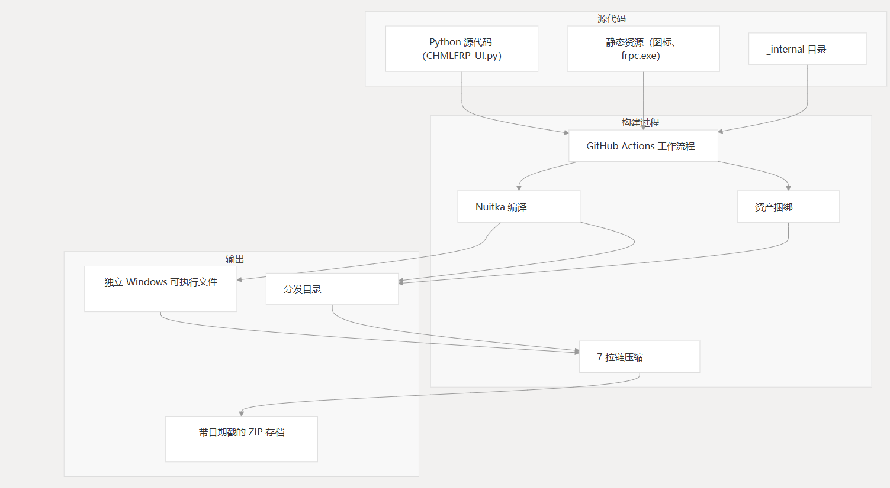
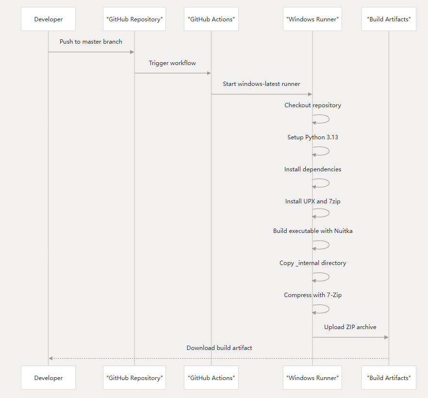
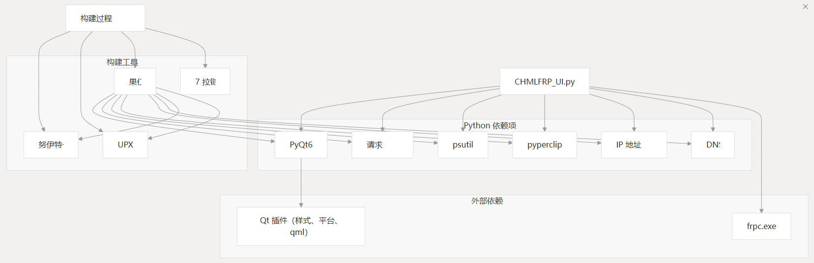
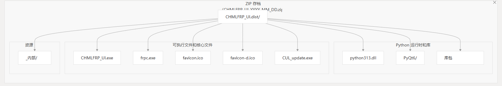
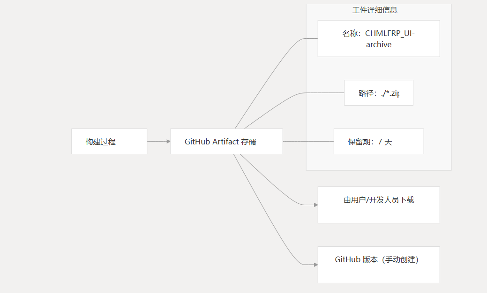

# 构建和部署

## 相关源文件
本文档介绍了 CHMLFRP UI 启动器 （CUL） 的构建和部署过程。

它涵盖了用于从 Python 源代码创建独立 Windows 可执行文件的自动化构建管道、依赖项管理和分发机制。

有关主要应用程序结构和组件的信息，请参阅核心应用程序。有关开发设置说明，请参阅开发指南。

## 构建系统概述

CHMLFRP UI Launcher 使用 GitHub Actions 自动执行构建过程，使用 Nuitka 将 Python 源代码转换为独立的 Windows 可执行文件。

这种方法消除了最终用户安装 Python 或依赖项的需要，因为所有内容都打包到单个应用程序中。

## 构建管道

构建管道作为 GitHub Actions 工作流程实现，该工作流程在对 master 分支的代码更改时自动运行。

### 工作流执行

### 构建步骤详解

- 环境设置：该工作流使用 Python 3.13 设置 Windows 环境并安装必要的工具。
  - python-version: '3.13'
  - pip install nuitka, upx
  - choco install upx, 7zip
- Nuitka 编译：Python 脚本经过优化后编译成独立的可执行文件。
  - Nuitka 关键参数：
    - --standalone：创建自包含应用程序
    - --python-flag=-O：启用优化
    - --include-data-files：捆绑必需的资源
    - --include-package：包括 Python 软件包
    - --upx-binary：指定用于压缩的 UPX
    - --windows-console-mode=disable：创建 GUI 应用程序
    - --windows-icon-from-ico：设置应用程序图标
- 资源捆绑：静态资源包含在最终可执行文件中。
  - favicon.ico/favicon-d.ico: Application icons
  - CUL_update.exe: Updater utility
  - frpc.exe: FRP client executable
  - _internal directory: Additional resources
- 压缩和打包：构建输出被压缩成一个带有日期戳的ZIP档案。
  - 7-Zip with maximum compression (level 9)
  - Multi-threading enabled
  - Archive named with date format: `CHMLFRP_UI_YYYY_MM_DD.zip`

## 依赖项

该应用程序依赖于通过构建过程管理的多个依赖项。

### Python 依赖项

| 屬地        | 目的                  | 包含方法                         |
|-----------|---------------------|------------------------------|
| PyQt6     | GUI 框架              | --include-package=PyQt6      |
| requests  | 用于 API 调用的 HTTP 客户端 | --follow-import-to=requests  |
| psutil    | 进程监控                | --follow-import-to=psutil    |
| pyperclip | 剪贴板操作               | --follow-import-to=pyperclip |
| ipaddress | IP 地址验证             | --follow-import-to=ipaddress |
| dns       | DNS操作               | --follow-import-to=dns       |

### 外部依赖

| 屬地       | 目的           | 处理                         |
|----------|--------------|----------------------------|
| frpc.exe | FRP 客户端可执行文件 | 捆绑为数据文件                    |
| UPX      | 二进制压缩        | 在构建过程中使用                   |
| Qt 插件    | GUI 组件       | 包括 via--include-qt-plugins |

### 依赖关系解析图

## 分发

分发过程会创建一个独立的 Windows 应用程序，无需安装 Python 或任何依赖项即可运行该应用程序。

### 分发包结构

### 工件管理

生成工件包括：

- 存储在 GitHub 上：在 GitHub Actions 工作流程中作为构件上传
- 保留策略：可下载 7 天
- 命名约定：包含用于版本跟踪的日期戳 （YYYY_MM_DD）

## 优化

构建过程实施了多项优化以改进分发包：

- 二进制压缩：UPX 用于减小可执行文件大小
- 选择性导入：仅包含必要的软件包
- 高压缩比：7-Zip，最大压缩设置：
  - Compression level: 9 (maximum)
  - Multi-threading: enabled
  - Dictionary size: 273 (large)
  - Passes: 15 (thorough compression)

## 部署注意事项

在构建过程中创建可分发包时，将手动处理到最终用户的实际部署。典型的部署工作流是：

1. 开发人员将更改推送到 master 分支
2. GitHub Actions 工作流构建应用程序
3. 开发人员下载工件
4. 开发人员测试打包的应用程序
5. 开发人员通过适当的渠道分发应用程序

有关开发环境设置和贡献指南，请参阅开发指南。