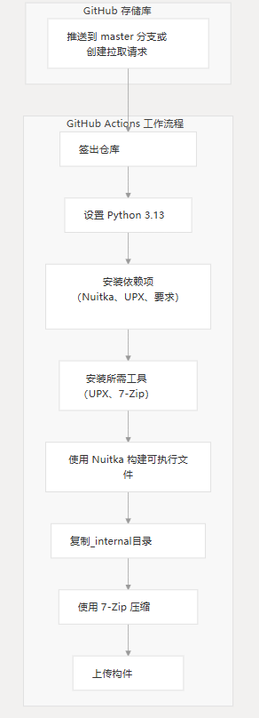
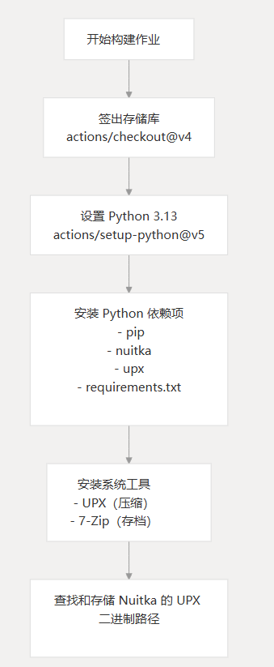
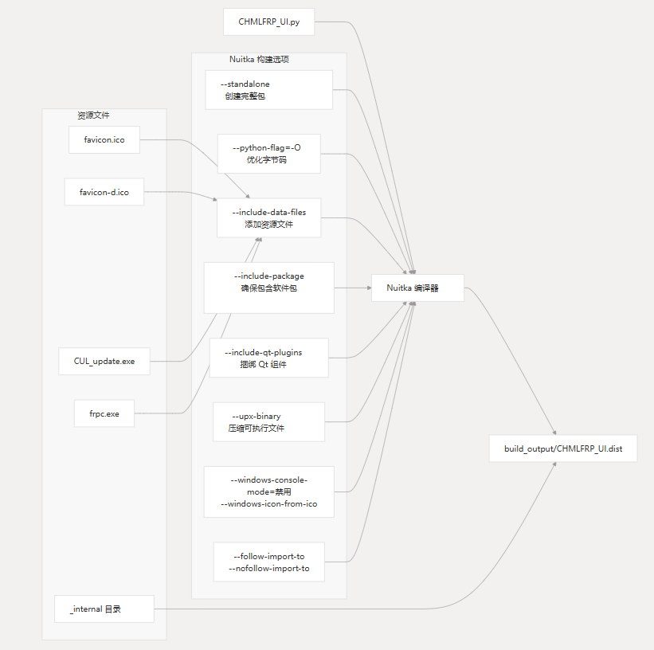
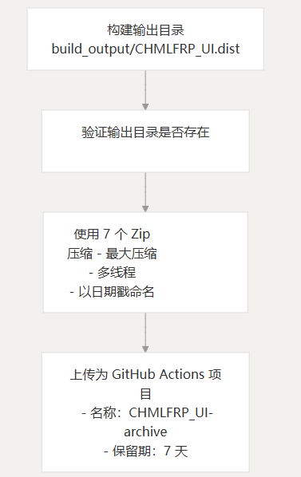
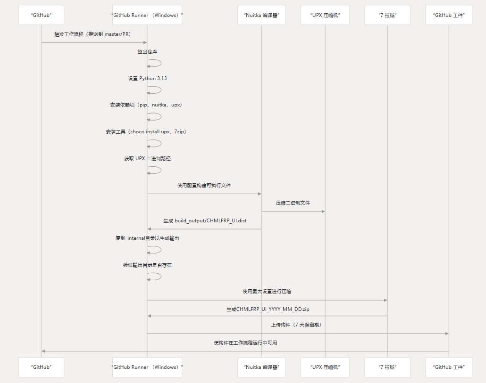

# 构建管道

### 目的和范围

本文档详细介绍了用于将 CHMLFRP UI 启动器 （CUL） 构建为独立 Windows 可执行文件的持续集成 （CI） 管道。

它重点介绍 GitHub Actions 工作流配置、Nuitka 构建过程和构件生成。

有关应用程序所需的依赖项的信息，请参阅依赖项，有关如何分发应用程序的详细信息，请参阅分发。

## 构建管道概述

CHMLFRP UI 启动器在将代码推送到 master 分支或创建面向 master 的拉取请求时，使用 GitHub Actions 自动构建应用程序。

构建过程使用 Nuitka 将 Python 应用程序编译为独立的 Windows 可执行文件，捆绑必要的资源，使用 UPX 应用压缩，并将所有内容打包到 ZIP 存档中。

## 工作流触发条件

GitHub Actions 工作流程配置为在以下情况下自动运行：

- 当代码被推送到分支时 master
- 针对分支创建拉取请求时 master

这可确保对主代码库的每次更改都是自动构建和测试的。

## 构建环境和设置

构建过程在 GitHub Actions 提供的最新 Windows 环境上运行，该环境与应用程序的目标平台保持一致。

### 构建环境设置过程

该工作流将安装以下关键工具：

- Python 3.13
- Nuitka（Python 到可执行编译器）
- UPX（可执行压缩器）
- 7-Zip（文件存档器）
- requirements.txt 中的特定于项目的依赖项

## Nuitka 构建配置

构建过程的核心使用 Nuitka 将 Python 应用程序编译为独立的可执行文件。Nuitka 将 Python 代码转换为 C，然后进行编译，从而提高性能并成为不需要安装 Python 的独立应用程序。

### 关键的 Nuitka 构建选项

| 选择                             | 描述                     |
|--------------------------------|------------------------|
| --standalone                   | 创建包含所有依赖项的独立应用程序       |
| --python-flag=-O               | 优化字节码的性能               |
| --include-data-files           | 将所需的资源文件与可执行文件捆绑在一起    |
| --include-package=PyQt6        | 确保 PyQt6 包包含在构建中       |
| --upx-binary                   | 指定要用于压缩的 UPX 二进制文件     |
| --include-qt-plugins           | 包括必要的 Qt 插件（样式、平台、qml） |
| --windows-console-mode=disable | 在应用程序运行时隐藏控制台窗口        |
| --windows-icon-from-ico        | 设置应用程序图标               |
| --follow-import-to             | 指定导入分析期间要遵循的包          |
| --nofollow-import-to           | 指定在导入分析期间要忽略的包         |

### 资源文件处理

构建过程在最终可执行文件中包含几个关键资源文件：

- favicon.ico - 主应用程序图标
- favicon-d.ico - 深色模式应用程序图标
- CUL_update.exe - 更新实用程序可执行文件
- frpc.exe - 用于隧道连接的 FRP 客户端可执行文件
- _internal directory - 其他应用程序资源（在 Nuitka 构建后复制）

## 工件生成和发布

构建完成后，工作流程会压缩输出并将其作为 GitHub Actions 构件上传。

### 压缩设置

构建输出使用 7-Zip 压缩，并具有以下优化设置：

- 格式：ZIP （-tzip)
- 压缩级别：最大 （-mx=9)
- 多线程：已启用 （-mmt=on)
- 词典大小：大 （-mfb=273)
- 传球数：15 （-mpass=15)

这将产生更小的分发文件，同时保持所有功能。

### 工件命名和保留

最终的工件是：

- 使用当前日期的格式命名：CHMLFRP_UI_YYYY_MM_DD.zip
- 上传到 GitHub Actions，保留期为 7 天
- 可从 GitHub Actions 工作流程运行页面下载

## 完整的构建过程序列

下图显示了构建过程从开始到结束的完整序列：

## 访问 Build Artifacts

工作流成功完成后，可以通过以下方式访问构建的构件：

- 存储库的 GitHub Actions 选项卡
- 特定工作流程运行
- 工作流程运行页面底部的 “Artifacts” 部分

构件已命名，并包含带有日期戳名称的 ZIP 文件：`CHMLFRP_UI-archive`