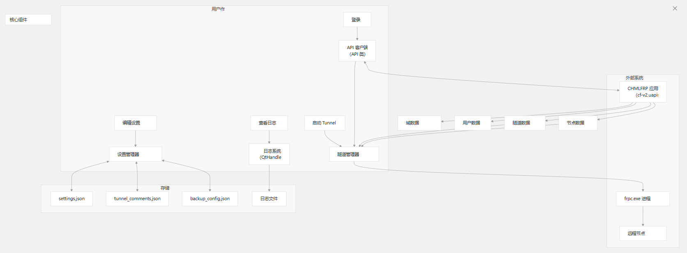

# 架构概述

- 目的和范围

本文档介绍了 CHMLFRP UI 启动器（CUL）系统的高级体系结构。

它概述了主要组件、它们的交互和整体系统设计。

本文档重点介绍应用程序的结构组织，而不是实现细节。有关特定特性和功能的信息，请参阅特性和功能。有关系统要求，请参阅系统要求。

## 系统概述

CHMLFRP UI Launcher（CUL）是一个桌面应用程序，它提供用于管理 CHMLFRP 隧道的图形界面。

该应用程序允许用户创建、配置、启动和监控通过 CHMLFRP 服务将本地服务连接到公共网络的隧道。

## 客户端-服务器架构

CUL 应用程序遵循客户端-服务器架构，其中：

- CUL 客户端（桌面应用程序）与 CHMLFRP API 服务器通信
- 客户端管理建立隧道连接的本地 `frpc.exe` 进程
- frpc 进程连接到远程 CHMLFRP 节点以创建隧道
此体系结构将用户界面、API 通信和隧道管理等问题分开。

API 通信流程

## 主要应用程序组件

该应用程序分为几个相互交互的关键组件。

- Data Layer
- Business Logic Layer
- User Interface Layer

## 组件职责

| 元件     | 角色                     | 主要类/函数                                                                       |
|:-------|:-----------------------|:-----------------------------------------------------------------------------|
| 用户界面   | 为用户交互提供图形界面            | MainWindow、TunnelCard、DomainCard、BatchEditDialog、OutputDialog、SettingsDialog |
| API 通信 | 处理对 CHMLFRP 服务的 API 请求 | API 类                                                                        |
| 流程管理   | 管理 frpc.exe 流程         | kill\_remaining\_frpc\_processes 函数                                          |
| 设置管理器  | 管理应用程序设置               | Pre\_run\_operations 类                                                       |
| 通知系统   | 为事件提供电子邮件通知            | message\_push 类                                                              |
| 更新系统   | 检查应用程序更新               | ProgramUpdates 类                                                             |
| 输入验证   | 验证用户输入                 | enter\_inspector 类                                                           |

## 数据管理

配置文件

该应用程序使用多个 JSON 文件来存储配置数据：

- settings.json：存储应用程序设置，包括主题首选项、日志设置、自动启动隧道 ID、电子邮件通知设置
- tunnel_comments.json：存储用户定义的隧道注释
- backup_config.json：存储隧道的备份节点配置

这些文件通过配置管理功能进行管理。

## 组件之间的数据流

## 流程管理

该应用程序管理 `frpc.exe` 进程，以建立和维护到 CHMLFRP 节点的隧道。

### 流程生命周期

- 应用程序将启动 `frpc.exe`，并为每个激活的隧道提供适当的配置。
- 监控过程状态以检测断开连接或故障。
- 当隧道停止时，相应的 `frpc.exe` 进程将终止。
- 在应用程序退出时，将清理所有剩余的 `frpc.exe` 进程。

## 用户界面架构

UI 使用 PyQt6 构建，并遵循基于组件的架构。

### 主要 UI 组件

## API 集成

该应用程序与 CHMLFRP API 集成，以：

- 对用户进行身份验证并获取令牌
- 检索用户隧道配置
- 获取节点信息和状态
- 获取域详细信息
- 监控节点在线/离线状态

### API 方法

| 方法                     | 目的        | API 终端节点                          |
|------------------------|-----------|-----------------------------------|
| `API.login`            | 对用户进行身份验证 | https://cf-v2.uapis.cn/login      |
| `API.get_nodes`        | 获取节点信息    | https://cf-v2.uapis.cn/node       |
| `API.is_node_online`   | 检查节点状态    | https://cf-v2.uapis.cn/node_stats |
| `API.get_user_tunnels` | 获取用户的隧道   | https://cf-v2.uapis.cn/tunnel     |
| `API.userinfo`         | 获取用户信息    | https://cf-v2.uapis.cn/userinfo   |

## 通知系统

该应用程序包括一个电子邮件通知系统，可提醒用户注意以下事件：

- 隧道离线状态
- 节点离线状态
- 隧道启动事件
- Node 在线事件
- 节点添加或删除

通知系统由 `message_push` 类实现，该类处理 SMTP 配置和电子邮件发送。

## 更新机制

该应用程序包括一个更新检查机制，该机制：

- 查询 GitHub 发布 API 以获取最新版本
- 将其与当前版本进行比较
- 如果有可用更新，则通过多个镜像提供下载链接
- 处理 DNS 解析和故障转移以实现可靠的更新检查

更新机制由 `ProgramUpdates` 类实现。

## 总结

CHMLFRP UI 启动程序 (CUL) 遵循客户端-服务器架构，其中客户端应用程序管理用户界面、配置和 `frpc` 进程，同时与 CHMLFRP API 通信以获取身份验证和服务信息。

模块化设计将 UI 组件、业务逻辑和数据管理分开，以创建可维护和可扩展的应用程序结构。
