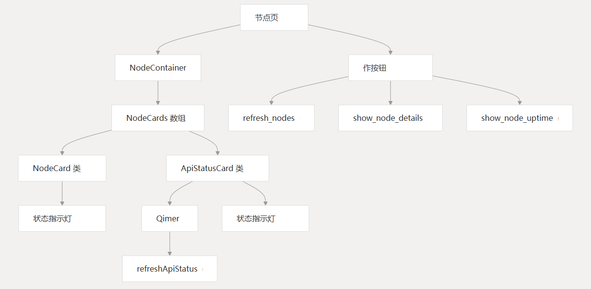

# 核心应用

核心应用程序是 CHMLFRP UI 启动器（CUL）的核心组件，用于实现主要功能、用户界面和业务逻辑。本文档提供了核心架构、组件及其交互的技术概述。

有关整体架构的信息，请参阅架构概述，有关构建和部署的详细信息，请参阅构建和部署。

## 概述

核心应用程序主要在文件中实现，该文件包含主窗口类和所有支持组件。

该应用程序遵循模块化设计，为不同的 UI 元素、后台进程和 API 交互提供单独的类。`CHMLFRP_UI.py`

## 主窗口架构

该类充当整个应用程序的主容器和控制器。

它实现了一个自定义的无框窗口，其中包含标题栏、侧边菜单、用于不同功能的内容区域和一个日志显示区域。`MainWindow`

## UI 结构

`MainWindow` 通过侧边菜单按钮和内容堆栈小部件的组合实现选项卡式界面：

| UI 组件 | 目的          |
|-------|-------------|
| 标题栏   | 自定义窗口控件和标题  |
| 侧边菜单  | 在主要功能之间导航   |
| 内容堆栈  | 包含不同的功能页面   |
| 日志显示  | 显示应用程序日志和消息 |

内容堆栈包含四个主要页面：
- 用户信息页面 - 登录和账户信息
- 隧道管理页面 - 使用卡片管理隧道
- 域名管理页面 - 使用卡片管理域名
- 节点状态页面 - 查看节点状态信息

## 认证系统

身份验证系统管理用户凭证、登录/注销功能和令牌验证。它支持用户名/密码身份验证和直接令牌身份验证。

身份验证流程包括：
- 用户输入的凭据（用户名/密码或令牌）
- 凭据的 API 验证
- 在 Windows 注册表中存储有效凭证
- 加载用户数据和隧道
- 自动启动配置的隧道

## 隧道管理系统

隧道管理系统是一个核心组件，允许用户创建、编辑、启动、停止和监控隧道。每个隧道都由 UI 中的一个对象表示。`TunnelCard`

隧道管理系统的主要特点：
- 基于卡片的 UI，用于隧道的可视化表示
- `frpc.exe` 流程管理
- 输出监控和显示
- 用于故障转移的备份节点配置
- 批量编辑功能
- 组织化的隧道注释

## 隧道卡片组件

该类是一个自定义 UI 组件，用于显示隧道信息并提供用于启动和停止隧道的控件：`TunnelCard`

隧道卡显示：
- 隧道名称和类型
- 本地和远程连接信息
- 状态指示灯（正在运行/已停止）
- 开始/停止按钮
- 具有复制功能的连接链接
- 备份节点状态
- 用户定义的注释

## 域名管理系统

域名管理系统允许用户创建、编辑和删除域名映射。

每个域名都由 UI 中的一个对象表示。`DomainCard`

域卡显示：
- 域名和子域名
- 记录类型
- 目标信息
- TTL 值
- 用户备注
- 具有复制功能的链接

## 节点状态系统

节点状态系统展示 CHMLFRP 网络节点和 API 服务器状态的实时信息。它包括两种卡片类型：用于普通节点和用于 API 服务器。`NodeCard` 和 `ApiStatusCard`

节点状态系统的主要特点：
- 节点状态的视觉指示器（在线/离线）
- 资源利用率信息（CPU、带宽）
- 节点组和位置信息
- 正常运行时间统计
- API 服务器性能监控
- 自动刷新状态信息

## 流程管理系统

流程管理系统处理建立实际隧道的 `frpc.exe` 进程的创建、监控和终止。

流程管理系统的主要特点：
- 使用适当的参数创建进程
- 输出捕获和解析
- 进程终止和清理
- 监控进程故障
- 通过 `OutputDialog` 显示输出

## 设置和配置

设置系统通过设置对话框管理应用程序首选项，并将配置保存到 JSON 文件。

系统管理的关键设置：
- 主题偏好（浅色、深色、系统）
- Windows 启动时自动启动
- 应用程序启动时自动启动隧道
- 日志文件大小和保留设置
- 电子邮件通知配置
- 通知事件偏好

## 通知系统

通知系统为整个课程中的各种系统事件提供电子邮件警报。`message_push`

通知系统功能：
- 可配置的电子邮件服务器设置
- 基于事件的通知
- 可定制的通知模板
- 自动检测常用提供商的 SMTP 设置
- 连接失败的回退逻辑

## 更新系统

更新系统通过 `UpdateCheckerDialog` 和 `ProgramUpdates` 类检查并促进应用程序更新的安装。

更新系统功能：
- 版本比较逻辑
- 用于下载的镜像选择
- 下载进度监控
- 本地更新文件检测
- 更新安装过程

## 备份节点系统

备份节点系统通过配置可在主节点不可用时使用的备用节点，为隧道提供故障转移功能。

备份节点系统的特点：
- 为每个隧道选择备份节点
- 备份节点的域名配置
- 主节点离线时自动故障转移
- 域名更新以指向活动节点
- 隧道卡片中的状态显示

## 结论

CHMLFRP UI 启动器的核心应用程序提供了一组全面的功能，用于管理 FRP 隧道、域名和监控节点状态。

其模块化设计将关注点分离为不同的组件，同时保持它们之间的集成。主窗口充当中央控制器，协调各个子系统以提供有凝聚力的用户体验。
