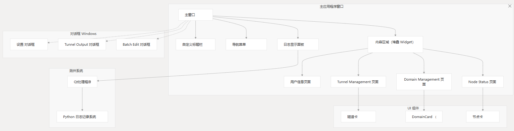
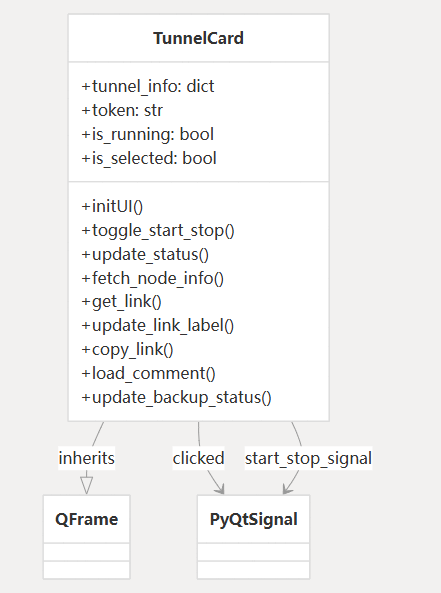
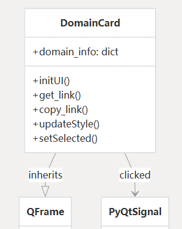
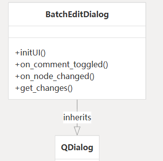
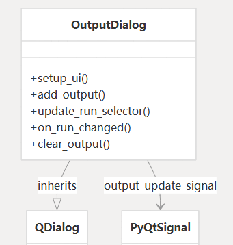
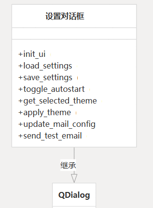
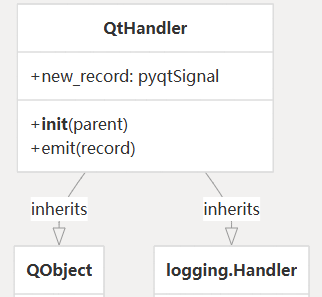
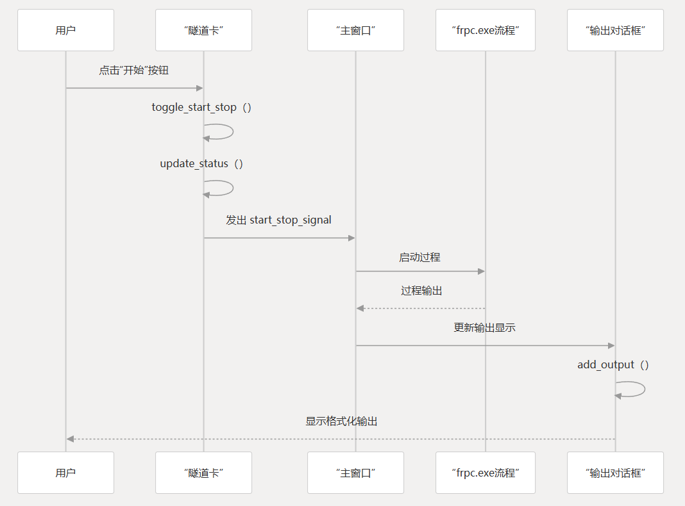
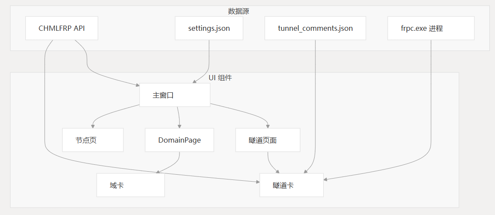

# 用户界面

本文档提供了 CHMLFRP UI 启动器（CUL）中用户界面组件的技术概述。

它涵盖了主窗口布局、UI 组件、对话框窗口和主题自定义。

有关 UI 如何与隧道管理功能交互的信息，请参阅隧道管理。

有关 API 集成的详细信息，请参阅 API 集成。

## UI 组件体系结构

CUL 应用程序是使用 PyQt6 构建的，并遵循基于组件的架构。

主窗口充当各种专用组件的容器，这些组件处理应用程序功能的不同方面。



## 核心 UI 组件

### 隧道卡

`TunnelCard` 类是一个专用的 `QFrame`，用于显示单个隧道的信息和控制。每个卡代表一个隧道配置，并提供交互式控件来管理它。



`TunnelCard` 的主要功能包括：
- 显示隧道是否正在运行的状态指示器
- 用于控制隧道进程的 Start/Stop 按钮
- 连接详细信息，包括本地和远程端点
- 连接 URL 的单击复制功能
- 支持用户定义的注释
- 通过颜色编码的状态指示器提供视觉反馈

### 域名卡

`DomainCard` 类显示有关向服务注册的域名的信息。与 `TunnelCard` 类似，它扩展了 `QFrame` 并提供域名详细信息的可视化表示。



每个 `DomainCard` 显示：
- 域名和记录类型
- 目标信息
- TTL（生存时间）值
- 用户定义的备注
- 域名 URL 的复制功能

## 对话框窗口

### 批量编辑对话框

`BatchEditDialog` 提供了一个同时批量编辑多个隧道的接口。它允许用户修改多个选定隧道中的通用属性。



`BatchEditDialog` 的功能包括：
- 节点选择和详细的节点信息显示
- 隧道类型选择（TCP、UDP、HTTP、HTTPS）
- 本地 IP/主机名和端口配置
- 加密和压缩选项
- 多个隧道的注释编辑
- API 版本选择（V1/V2）
- 用于重新创建隧道的 Force update 选项

### 输出对话框

`OutputDialog` 显示正在运行的 `frpc.exe` 进程的实时控制台输出。它提供了一种监控隧道状态和排查连接问题的方法。



主要功能：
- 以格式化的 HTML 显示控制台输出
- 支持查看多个隧道运行
- 通过下拉菜单运行选择
- 输出清除功能
- 自动滚动到最新输出

### 设置对话框

`SettingsDialog` 提供了一个全面的界面，用于通过选项卡式布局配置应用程序设置。



该对话框分为不同设置类别的选项卡：
- **常规**：主题选择、自动启动、日志配置
- **隧道**：选择要自动启动的隧道
- **通知**：警报和通知的电子邮件配置

## 测井系统

该应用程序使用 `QtHandler` 类将 Python 的日志记录系统与 Qt 接口集成。此处理程序将日志消息重定向到 UI 进行显示。



`QtHandler` 的功能：
- 将 Python 日志记录转换为格式化字符串
- 当新的日志条目可用时发出信号
- 在整个应用程序中保持一致的格式

## 主题系统

该应用程序通过一致的样式方法支持多个主题：

| 主题 | 描述            | 实现方法             |
|----|---------------|------------------|
| 光  | 带有绿色强调的默认浅色外观 | 基于 Qt StyleSheet |
| 黑暗 | 带有蓝色调的深色模式    | 基于 Qt StyleSheet |
| 系统 | 遵循 OS 主题设置    | 样式检测和切换          |

主题通过影响所有组件的集中式样式表定义进行处理。

`SettingsDialog` 包含用于选择首选主题的控件，该主题保存在 `settings.json` 中，并在应用程序重新启动时应用。

### 样式表实现示例

```plaintext
# Light theme example
"""
QDialog, QTabWidget, QWidget {
    background-color: #FFFFFF;
    color: #000000;
}
QPushButton {
    background-color: #4CAF50;
    color: white;
    border: none;
    padding: 5px 10px;
    border-radius: 4px;
}
"""

# Dark theme example
"""
QDialog, QTabWidget, QWidget {
    background-color: #2D2D2D;
    color: #FFFFFF;
}
QPushButton {
    background-color: #0D47A1;
    color: white;
    border: none;
    padding: 5px 10px;
    border-radius: 4px;
}
"""
```
### UI 信号流
下图说明了 UI 中的用户操作如何通过 Qt 的信号和插槽机制触发应用程序行为：



### UI 组件关系
应用程序中 UI 组件和数据源之间的关系遵循以下模式：



 | UI 组件      | 数据源                    |
 |------------|------------------------|
 | 主窗口        | CHMLFRP API            |
 | 隧道卡        | `settings.json`        |
 | 域名卡        | `tunnel_comments.json` |
 | 隧道页面       | `frpc.exe` 进程          |
 | DomainPage | CHMLFRP API            |
 | 节点页        | CHMLFRP API            |

### UI 初始化和渲染

当应用程序启动时，它会执行以下 UI 初始化步骤：

- 从 settings.json 加载并应用主题设置
- 创建主窗口组件（标题栏、侧边菜单、内容区域、日志显示）
- 初始化专用内容页面（UserInfoPage、TunnelPage 等）
- 如果用户已登录，则从 API 获取数据
- 根据检索到的数据呈现隧道、域名和节点卡
- 根据当前主题将样式应用于所有组件

UI 旨在响应 API 数据更改，并在基础数据更改时提供刷新和更新显示的方法。
