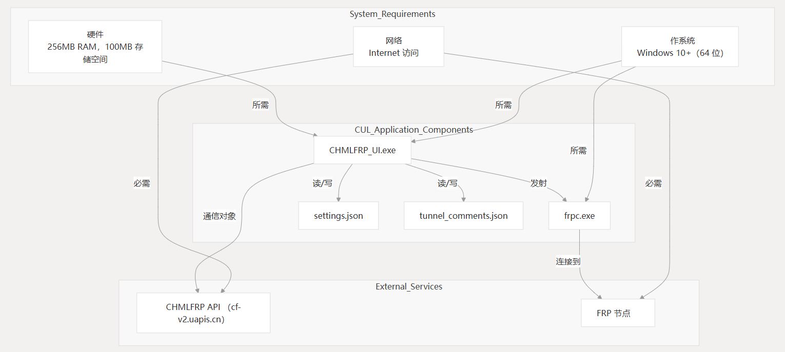

# 系统要求

本页介绍了运行 CHMLFRP UI Launcher （CUL） 应用程序所需的硬件、软件和网络要求。有关安装说明，请参阅[安装指南](#)。

## 硬件要求

| 元件  | 最低要求             | 推荐             |
|-----|------------------|----------------|
| 处理器 | 1 GHz x86-64 CPU | 双核 2 GHz 或更高   |
| 内存  | 256 MB 内存        | 512 MB 内存      |
| 存储  | 需要 300 MB 可用空间   | 需要 500 MB 可用空间 |
| 显示  | 800x600 分辨率      | 1280x720 或更高   |

## 软件要求

### 操作系统

- Windows 10（64 位）或更高版本
- 支持 Windows 11

该应用程序专为 Windows 环境设计，目前在其他操作系统上不受支持。

### 依赖

使用编译后的可执行文件时，所有依赖项都捆绑在一起。如果从源代码运行，则需要以下 Python 依赖项：

| 属性        | 版本     | 目的          |
|-----------|--------|-------------|
| PyQt6     | 6.9.0  | GUI 框架      |
| requests  | 2.32.3 | HTTP API 通信 |
| psutil    | 7.0.0  | 过程监控        |
| pyperclip | 1.9.0  | 剪贴板操作       |
| ipaddress | 1.0.23 | IP 地址验证     |
| urllib3   | 2.4.0  | HTTP 客户端    |
| Markdown  | 3.7    | Markdown 处理 |
| dnspython | 2.7.0  | DNS 解析      |

## 外部组件

- **frpc.exe** - 建立隧道的 Fast Reverse Proxy 客户端可执行文件
  - 此组件与应用程序分发捆绑在一起

## 网络要求

### API 连接

应用程序需要 Internet 访问权限才能与 CHMLFRP API 服务通信：

- API 端点：cf-v2.uapis.cn
- API 端点：cf-v1.uapis.cn
- 协议：HTTPS（端口 443）

### 隧道连接

对于隧道功能，需要以下网络条件：

- 到各种端口上的 FRP 节点的出站连接

- 适当的网络配置以允许流量通过隧道

## 组件依赖关系图

应用程序组件的系统要求：

与代码组件相关的要求：

## 文件系统访问要求
### 存储
安装：大约 300 MB 磁盘空间

运行：用于日志和配置文件的额外空间

### 文件访问

应用程序需要对以下内容的读写访问权限：

应用程序安装目录

本地配置文件：

settings.json - 应用程序设置

tunnel_comments.json - 隧道的用户评论

### 用户权限

标准用户权限足以运行应用程序

某些使用受限端口（低于 1024）的隧道配置可能需要管理权限

### 开发要求
如果您计划开发或修改 CUL 应用程序，则还需要满足其他要求。

有关详细信息，请参阅开发环境设置。

