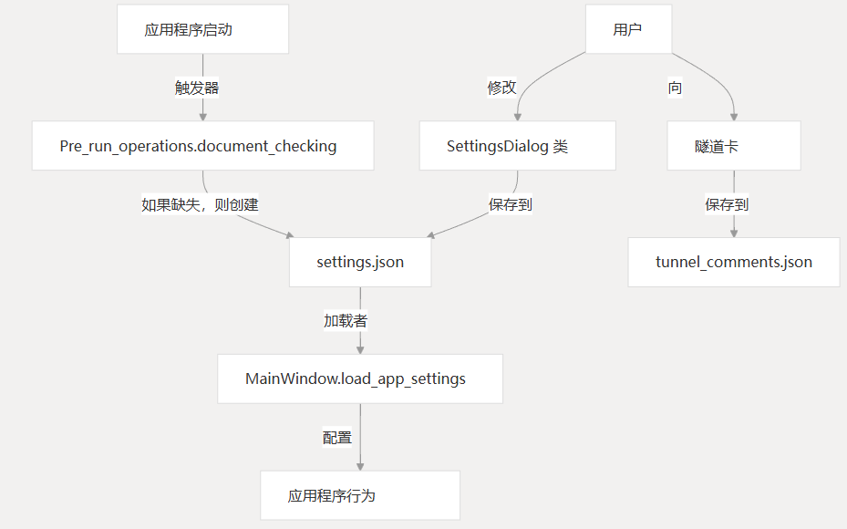
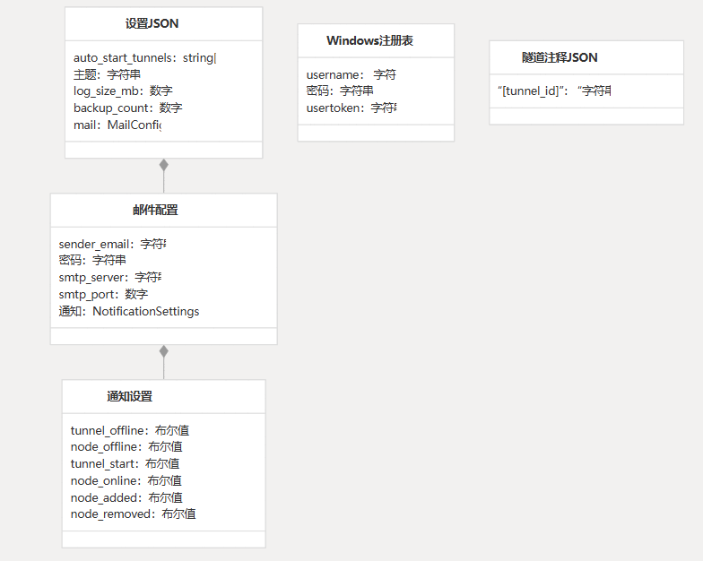
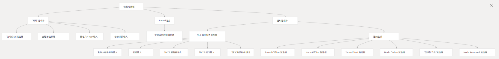

# 设置和配置

本页介绍了 CHMLFRP UI 启动器 （CUL） 的设置和配置系统。

它介绍了如何在应用程序中存储、加载和管理设置，以及控制应用程序行为的可用配置选项。

有关构建和部署应用程序的信息，请参阅构建和部署。

## 概述

CUL 应用程序使用 JSON 文件和 Windows 注册表项的组合来存储设置和用户凭据。

设置控制应用程序的行为、外观和功能，包括自动隧道启动、主题首选项和通知选项。

## 设置流程图



## 配置文件

该应用程序使用多个文件来存储配置和设置：

### 设置文件结构

主设置文件 （） 使用以下结构：



## 文件及其用途

| 文件/存储                | 目的     | 描述                                                   |
|----------------------|--------|------------------------------------------------------|
| settings.json        | 应用程序设置 | 存储用户首选项、主题设置、日志选项、自动启动隧道和电子邮件配置                      |
| tunnel_comments.json | 隧道注释   | 存储每个隧道的用户提供的注释/注释                                    |
| Windows 注册表          | 用户凭证   | 将用户名、密码和用户令牌安全地存储在HKEY_CURRENT_USER\SOFTWARE\ChmlFrp |

## 设置初始化

当应用程序首次启动或缺少配置文件时，它会通过该方法自动使用默认值创建它们。`Pre_run_operations.document_checking()`

### 默认设置

不存在配置文件时创建的默认设置为：

```
{
    "auto_start_tunnels": [],
    "theme": "light",
    "log_size_mb": 10,
    "backup_count": 30,
    "mail": {
        "sender_email": "",
        "password": "",
        "smtp_server": "",
        "smtp_port": "",
        "notifications": {
            "tunnel_offline": false,
            "node_offline": false,
            "tunnel_start": false,
            "node_online": false,
            "node_added": false,
            "node_removed": false
        }
    }
}
```

## “设置”对话框 UI

Settings Dialog 提供了一个用于管理所有配置选项的用户界面，分为三个选项卡：



### “常规”选项卡

General 选项卡包含基本的应用程序设置：

- 自动启动：在 Windows 启动时启动应用程序的选项
- 主题设置：在浅色、深色或系统主题之间进行选择
- 日志设置：控制日志文件大小（以 MB 为单位）和要保留的备份文件数

### Tunnel 选项卡

Tunnel 选项卡列出了所有可用的隧道，并允许用户选择在应用程序启动时应自动启动哪些隧道。此选项卡动态加载用户的隧道并显示其名称和注释。

### 通知选项卡

Notification （通知） 选项卡包含电子邮件通知的设置：

- 电子邮件服务器配置：用于发送通知的 SMTP 服务器的设置
- 通知选项：控制哪些事件触发电子邮件通知

## 加载和保存设置

### 加载设置

应用程序在启动时通过该方法加载设置，该方法读取设置文件并应用配置。这发生在应用程序初始化期间。`MainWindow.load_app_settings()`

```python
def load_app_settings(self):
    """Load application settings from settings.json"""
    # Read theme settings, etc.
```

### 保存设置

当用户单击 Save 按钮时，将从 Settings Dialog 中保存设置。该方法从 UI 控件收集当前值，并将其写入设置文件。`SettingsDialog.save_settings()`

```python
def save_settings(self):
    """Save settings to settings.json"""
    # Collect values from UI and save
```

## 配置选项的影响

### 主题设置

theme 设置会影响整个应用程序的外观：

- 浅色主题：使用白色背景和深色文本
- 深色主题：使用深色背景和浅色文本
- 系统主题：自动匹配 Windows 系统主题

选择并保存主题后，将调用该方法以使用适当的样式更新所有 UI 元素。`apply_theme()`

### 日志设置

- 日志大小 （MB）：控制轮换前每个日志文件的最大大小
- 备份数量：确定在删除之前保留多少个轮换日志文件

这些设置将应用于应用程序的日志记录系统的旋转文件处理程序。

### 自动启动隧道

在自动启动列表中选择的隧道将在应用程序启动时自动启动，无需用户交互。该方法获取要从 settings 开始的隧道列表并启动它们。`auto_start_tunnels()`

### 电子邮件通知

配置后，应用程序可以针对各种事件发送电子邮件警报：

- Tunnel Offline：当正在运行的隧道脱机时发出警报
- Tunnel Start：启动 tunnel 时的通知
- Node Offline：当节点不可用时发出警报
- Node Online：节点可用时的通知
- Node Added：将新节点添加到系统时发出警报
- Node Removed：从系统中删除节点时的通知

该类处理电子邮件的实际发送，而通知设置控制电子邮件的发送时间。`message_push`

## 凭证管理

用户凭据（用户名、密码和令牌）存储在 Windows 注册表中，以提高安全性。该应用程序使用以下方法管理凭据：

- `MainWindow.load_credentials()`：从注册表加载凭据
- `MainWindow.save_credentials()`：将凭据保存到注册表
- `MainWindow.logout()`：从注册表中删除凭据

## 测试电子邮件配置

“设置”对话框包括一个“发送测试电子邮件”按钮，允许用户在保存电子邮件配置之前验证其电子邮件配置。

这会向配置的电子邮件地址发送一条测试消息并显示结果。

测试功能使用该类尝试发送包含当前配置的电子邮件，从而提供有关设置是否正确的即时反馈。`message_push`

## 隧道注释系统

该应用程序允许用户向隧道添加注释或注释，以帮助识别其用途或配置。这些注释存储在主 UI 的隧道卡中并显示在其中。`tunnel_comments.json`

### 注释管理方法

该应用程序提供了几种管理隧道注释的方法：

- `get_tunnel_comment()`：检索特定隧道的注释
- `set_tunnel_comment()`：设置或更新隧道的注释
- `delete_tunnel_comment()`：删除隧道的注释
- `edit_tunnel_comment()`：显示一个对话框，用于编辑隧道的注释

注释是用户计算机的本地注释，不会与服务器同步。

## 旧版配置迁移

该应用程序包含用于从旧配置格式迁移的代码，包括将凭证从文件移动到 Windows 注册表。这允许从旧版本升级的用户保留其设置。

```
# Migrate old credentials to registry
credentials_path = get_absolute_path("credentials.json")
if os.path.exists(credentials_path):
    # Read credentials and save to registry
    # Then delete old file
```

## 电子邮件服务器自动检测

该应用程序包含一项功能，可根据电子邮件地址的域名自动检测电子邮件服务器设置。这通过为常用电子邮件提供商提供通用的 SMTP 服务器设置来简化用户的配置。
```python
CONFIG_MAP = {
    'qq.com': ('smtp.qq.com', 465),
    '163.com': ('smtp.163.com', 465),
    'aliyun.com': ('smtp.aliyun.com', 465),
    # and more...
}
```