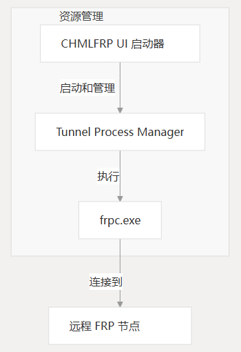
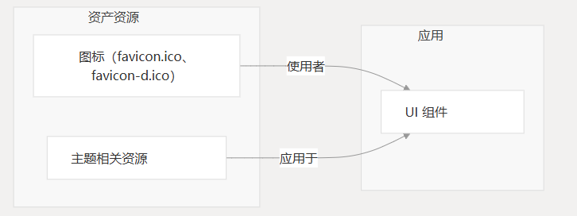
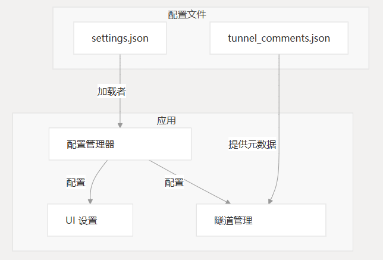
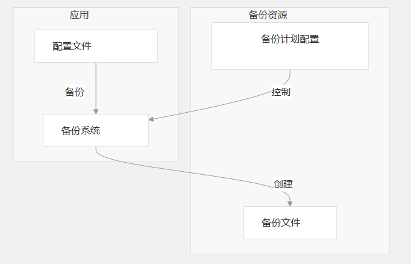
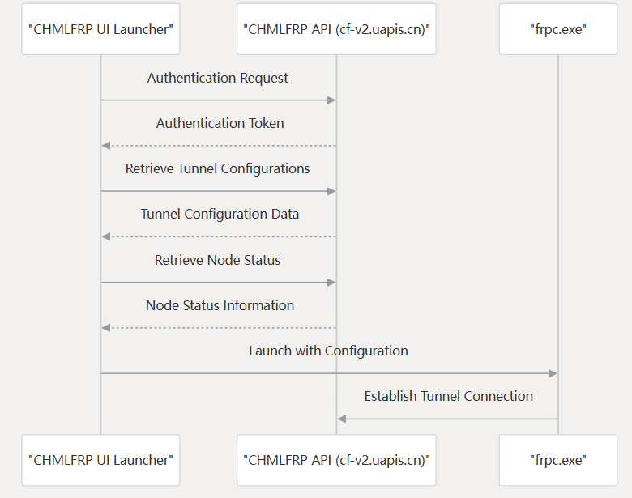

# 资源
本页记录了 CHMLFRP-UI-Launcher 使用的基本资源，包括可执行文件、资源、配置文件和应用程序运行所需的其他支持文件。

有关整体体系结构的信息，请参阅 [体系结构概述](#)。

## 关键可执行资源

CHMLFRP-UI-Launcher 依靠 Fast Reverse Proxy Client 可执行文件（`frpc.exe`）来建立和管理与远程节点的隧道连接。

此可执行文件与应用程序捆绑在一起，对于核心功能至关重要。

### 资源管理

CHMLFRP-UI-Launcher → 启动并管理 → `frpc.exe` → 执行 → 连接到 → `Remote FRP Nodes`

`frpc.exe`（Fast Reverse Proxy Client）是一个关键的可执行资源，它：

- 由 CHMLFRP UI 启动器使用适当的配置参数启动
- 建立与远程 CHMLFRP 节点的隧道连接
- 维护这些连接并处理实际的流量转发

Launcher 管理 `frpc.exe` 的多个实例，每个实例对应于一个配置的隧道。

## 资产资源

该应用程序使用各种资源资源来增强用户界面并提供视觉元素。

### 图标

该应用程序包括用于以下目的的图标：

- 应用程序窗口图标
- 任务栏表示
- 快捷方式图标

主要图标文件包括：

- `favicon.ico` - 标准应用程序图标
- `favicon-d.ico` - 替代图标，用于深色模式或不同状态

### 主题资产

CHMLFRP UI 启动器包括一个主题系统，允许自定义应用程序的外观。主题资产可能包括：

- 配色方案
- 样式定义
- 自定义控件外观

## 配置资源

该应用程序使用多个配置文件来存储设置、用户首选项和隧道信息。

### 配置文件

- `settings.json`
  - 存储应用程序范围的设置和用户首选项，包括：
    - API 连接设置
    - 用户界面首选项
    - 默认行为
    - 主题选择
    - 备份配置
  - 此文件由应用程序创建和维护，通常存储在用户的应用程序数据目录中。

- `tunnel_comments.json`
  - 存储用户定义的隧道注释和元数据。
  - 允许用户向他们配置的隧道添加注释和描述，以便于识别和管理。

## 备份系统资源

该应用程序包括一个备份系统，用于保留用户配置和设置。

### 备份资源

- **备份文件**
  - 重要配置文件的副本，例如 `settings.json` 和 `tunnel_comments.json`，以防止数据丢失。
- **备份计划配置**
  - 控制备份的频率和存储位置。

## 许可证资源

CHMLFRP-UI-Launcher 根据 GNU 通用公共许可证第 3 版（GPL-3.0）的条款进行分发，如应用程序随附的 `LICENSE` 文件所定义。

### GPL-3.0 许可证

- **授予用户**
  - 运行、学习、共享和修改软件的自由
- **要求**
  - 衍生作品也按照 GPL-3.0 获得许可
- **确保**
  - 软件保持免费和开源

许可证的全文可在项目存储库的 `LICENSE` 文件中找到。

## API 通信资源

该应用程序与 CHMLFRP API 通信，以验证用户身份、检索隧道配置和管理隧道。

### API 交互流程

- **身份验证请求**
  - 用户登录 → 获取身份验证令牌
- **检索隧道配置**
  - 使用身份验证令牌 → 获取隧道配置数据
- **检索节点状态**
  - 使用身份验证令牌 → 获取节点状态信息
- **启动隧道连接**
  - 使用配置 → 建立隧道连接

### 资源依赖关系摘要

下表总结了 CHMLFRP-UI-Launcher 中的关键资源及其角色：

| 资源                     | 类型  | 目的              |
|------------------------|-----|-----------------|
| `frpc.exe`             | 可执行 | 建立和管理隧道连接       |
| `favicon.ico`          | 资产  | 标准模式的应用程序图标     |
| `favicon-d.ico`        | 资产  | 替代应用程序图标        |
| `settings.json`        | 配置  | 存储应用程序设置和首选项    |
| `tunnel_comments.json` | 配置  | 存储隧道的用户注释       |
| `LICENSE`              | 文档  | 定义使用条款（GPL-3.0） |