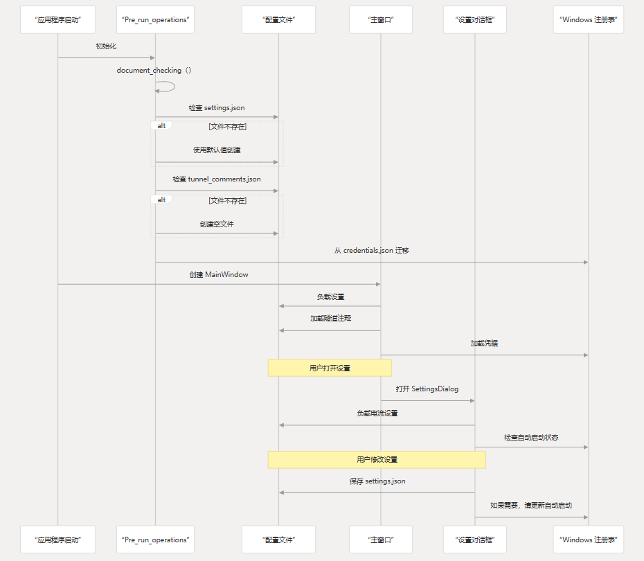

# 配置参考

本页提供了 CHMLFRP UI 启动器 （CUL） 的所有配置方面的全面参考。它涵盖了配置文件、它们的结构以及它们如何影响应用程序行为。

API 集成相关信息请参考 [API 参考](#)。有关构建和部署设置的详细信息，请参阅 [构建和部署](#)。

## 配置文件概述

CUL 使用多个配置文件来存储用户首选项、隧道信息和系统设置。这些文件是在应用程序首次运行时自动创建和初始化的。


## 主配置文件 (`settings.json`)

该文件是存储用户首选项和应用程序设置的主配置文件。如果不存在，则会自动使用默认值创建它。

### 文件结构

下表描述了 `settings.json` 的结构和默认值：

| 设置                                  | 类型  | 默认值       | 描述                                    |
|-------------------------------------|-----|-----------|---------------------------------------|
| `auto_start_tunnels`                | 数组  | `[]`      | 应用程序启动时自动启动的隧道 ID 列表                  |
| `theme`                             | 字符串 | `"light"` | UI 主题：`"light"`、`"dark"` 或 `"system"` |
| `log_size_mb`                       | 整数  | `10`      | 日志文件的最大大小（以 MB 为单位）                   |
| `backup_count`                      | 整数  | `30`      | 要保留的日志文件备份数                           |
| `mail`                              | 对象  | `{}`      | 电子邮件通知设置                              |
| `mail.sender_email`                 | 字符串 | `""`      | 用于发送通知的电子邮件地址                         |
| `mail.password`                     | 字符串 | `""`      | 电子邮件帐户的密码或应用程序专用密码                    |
| `mail.smtp_server`                  | 字符串 | `""`      | SMTP 服务器地址                            |
| `mail.smtp_port`                    | 整数  | `""`      | SMTP 服务器端口                            |
| `mail.notifications`                | 对象  | `{}`      | 通知首选项                                 |
| `mail.notifications.tunnel_offline` | 布尔  | `false`   | 在隧道脱机时启用通知                            |
| `mail.notifications.node_offline`   | 布尔  | `false`   | 在节点下线时启用通知                            |
| `mail.notifications.tunnel_start`   | 布尔  | `false`   | 在隧道启动时启用通知                            |
| `mail.notifications.node_online`    | 布尔  | `false`   | 在节点上线时启用通知                            |
| `mail.notifications.node_added`     | 布尔  | `false`   | 添加节点时启用通知                             |
| `mail.notifications.node_removed`   | 布尔  | `false`   | 在删除节点时启用通知                            |

### 示例配置

```json
{
  "auto_start_tunnels": ["123456", "789012"],
  "theme": "system",
  "log_size_mb": 20,
  "backup_count": 15,
  "mail": {
    "sender_email": "example@example.com",
    "password": "password123",
    "smtp_server": "smtp.example.com",
    "smtp_port": 465,
    "notifications": {
      "tunnel_offline": true,
      "node_offline": true,
      "tunnel_start": false,
      "node_online": false,
      "node_added": true,
      "node_removed": true
    }
  }
}
```

## 隧道注释配置 (tunnel_comments.json)
该文件存储用户定义的隧道注释。它可以帮助用户使用自定义注释识别和组织他们的隧道。
### 文件结构
该文件是一个简单的 JSON 对象，其中 keys 是隧道 ID，values 是相应的注释：
```
{
  "123456": "Web server tunnel",
  "789012": "Game server - Minecraft",
  "345678": "Development API"
}
```
注释显示在主 UI 的隧道卡和自动启动隧道选择列表中。

## 备份节点配置 (backup_config.json)
该文件存储备份节点和域绑定的配置。它允许隧道在主节点不可用时自动故障转移到备份节点。
### 文件结构
该文件是一个 JSON 对象，其中每个键都是一个隧道 ID，其值是一个包含备份配置的对象：
```
{
  "123456": {
    "nodes": ["node1", "node2"],
    "domain": {
      "domain": "example.com",
      "record": "api",
      "last_updated": "2023-05-01 12:34:56"
    }
  }
}
```
## 配置加载和应用程序流程
下图说明了如何在整个应用程序中加载和应用配置：



## 设置管理 UI


### 常规设置

General 选项卡包括：

Autostart 选项 - 控制应用程序是否在 Windows 启动时自动启动
- 主题设置 - 在浅色、深色或系统主题之间进行选择
- 日志设置 - 配置日志文件大小和保留计数

### 隧道设置

Tunnels 选项卡允许配置应用程序启动时应自动启动的隧道。

每个隧道都可以单独启用或禁用自动启动。

### 通知设置

Notifications （通知） 选项卡包含：

1.电子邮件服务器配置
- 发件人电子邮件地址
- 密码/应用程序专用密码
- SMTP 服务器和端口
- 常见电子邮件提供商的预设配置
- 测试电子邮件功能


通知首选项
- 隧道脱机/启动通知
- 节点离线/在线通知
- 节点添加/删除通知


## 凭证存储

CUL 中的凭据已从基于文件的存储迁移到 Windows 注册表，以提高安全性。

## 注册表结构

凭据存储在以下 Windows 注册表位置：

```
HKEY_CURRENT_USER\SOFTWARE\ChmlFrp
```
存储以下值：

- username- 用户的 CHMLFRP 用户名
- password- 用户的 CHMLFRP 密码
- usertoken- 用户的身份验证令牌

## 自动启动配置

应用程序自动启动设置存储在标准的 Windows 自动启动注册表位置：
```
HKEY_CURRENT_USER\Software\Microsoft\Windows\CurrentVersion\Run
```
启用后，将添加一个名为 的键，其值为可执行文件的路径。`ChmlFrpUI`

## 电子邮件通知配置

该应用程序支持各种事件的电子邮件通知。配置通过 类 进行管理。message_push

| 域             | SMTP 服务器           | 端口  |
|---------------|--------------------|-----|
| qq.com        | smtp.qq.com        | 465 |
| 163.com       | smtp.163.com       | 465 |
| aliyun.com    | smtp.aliyun.com    | 465 |
| 126.com       | smtp.126.com       | 465 |
| foxmail.com   | smtp.exmail.qq.com | 465 |
| sina.com      | smtp.sina.com      | 465 |
| sohu.com      | smtp.sohu.com      | 465 |
| yes.net       | smtp.yeah.net      | 465 |
| 21cn.com      | smtp.21cn.com      | 465 |
| vip.qq.com    | smtp.vip.qq.com    | 465 |
| 263.net       | smtp.263.net       | 465 |
| exmail.qq.com | smtp.exmail.qq.com | 465 |
该应用程序还支持根据电子邮件域自动检测 SMTP 设置。

### 电子邮件通知流程


### 备份节点和域配置
该应用程序支持通过 BackupNodeConfigDialog 类为隧道配置备份节点和域绑定。

### 备份节点配置流程
当隧道配置了备份节点时，如果主节点不可用，应用程序将自动尝试使用这些备份节点。配置存储在 `backup_config.json` 文件中。

### 域绑定配置
对于 HTTP/HTTPS 隧道，可以绑定域以确保无缝故障转移。域配置包括：
- 域名 - 主域名（例如 example.com）
- Record - 子域（例如 api）
- Last updated - 上次配置更新的时间戳

### 配置初始化过程
当应用程序启动时，它通过以下方法对配置文件执行一系列检查和初始化：`Pre_run_operations.document_checking()`
1.检查是否存在`settings.json`
- 如果没有，请使用默认值创建它
- 如果为空，则使用默认值对其进行初始化

2.检查是否存在`tunnel_comments.json`
- 如果没有，请使用空对象创建它
- 如果为空，则使用空对象初始化它

3.将旧凭据从 迁移到 Windows 注册表`credentials.json`
- 从文件中读取凭证
- 写入注册表
- 删除旧文件


