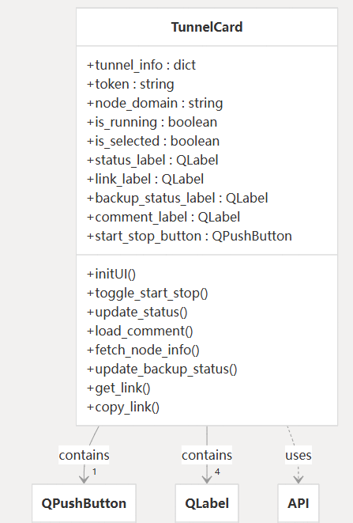
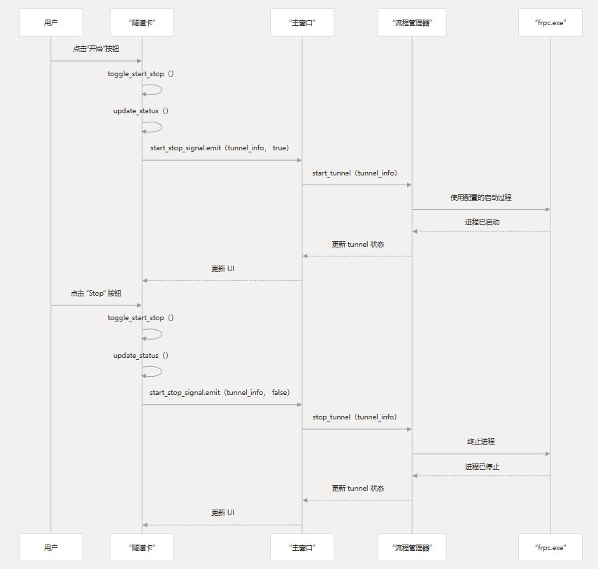
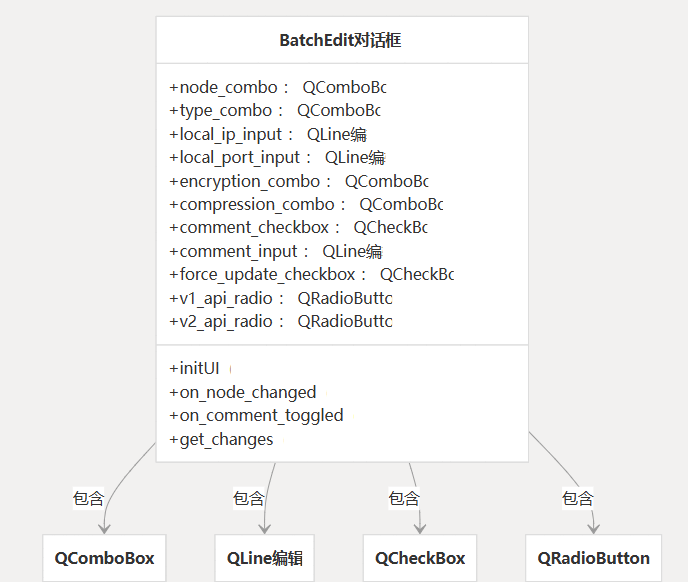
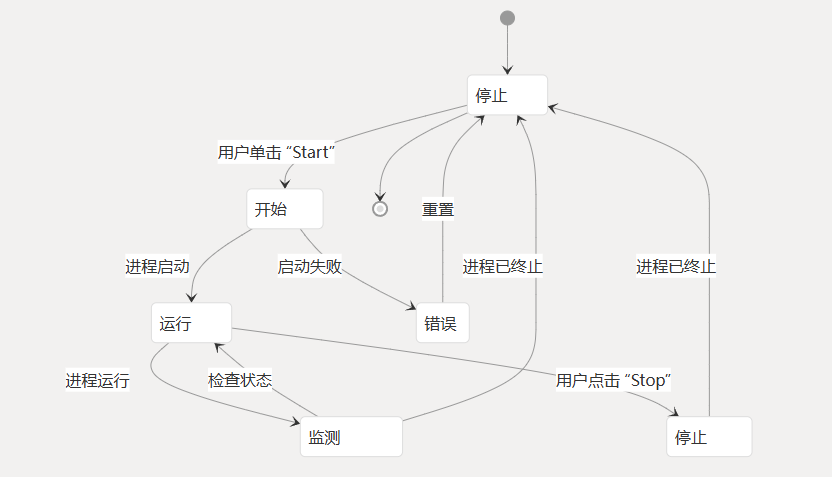
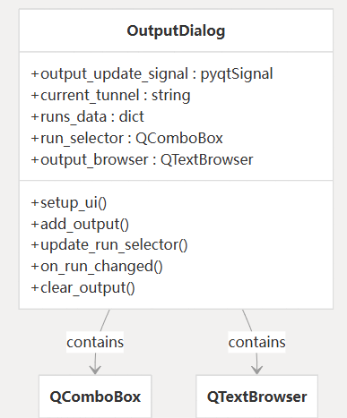
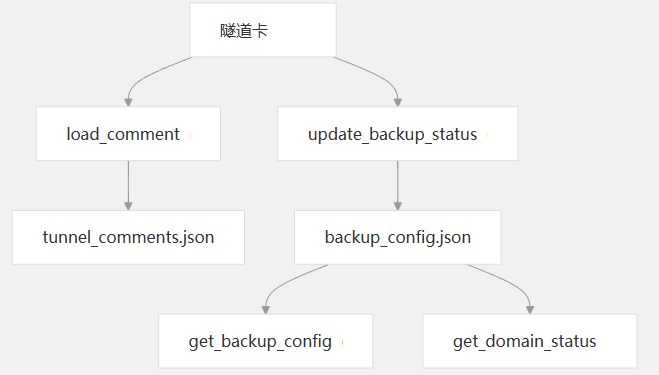
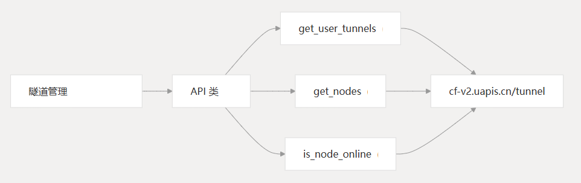

# 隧道管理

### 目的和范围

本文档介绍 CHMLFRP-UI-Launcher（CUL）应用程序中的隧道管理系统。

隧道管理负责显示、启动、停止和配置 FRP 隧道，这些隧道通过 CHMLFRP 节点将本地服务连接到远程端点。

本文档介绍了如何在 UI 中表示隧道、如何管理隧道进程以及用户如何与隧道交互。

有关与 CHMLFRP 服务器的 API 通信的信息，请参阅 API 集成。

有关如何保存和加载设置的详细信息，请参阅设置和配置。

## 概述

隧道管理子系统允许用户查看、控制和配置 FRP 隧道。每个隧道表示本地服务（由本地 IP 地址和端口定义）和远程终结点（由远程端口或域定义）之间的连接。

隧道是通过 CHMLFRP API 创建和管理的，但通过进程在本地执行。`frpc.exe`

## 隧道表示

隧道在 UI 中使用 `TunnelCard` 类表示，该类显示隧道属性并提供用于管理隧道的控件。

### TunnelCard 组件

每个隧道在 UI 中显示为一张卡片，其中包含以下信息：
- 隧道名称
- 隧道类型（TCP、UDP、HTTP、HTTPS）
- 本地终端节点（IP:port）
- 远程端点（端口或域）
- 节点名称
- 运行状态
- 连接链接
- 备份节点状态
- 用户评论

该卡还提供用于启动或停止隧道的按钮。



## 隧道数据结构

隧道信息从 CHMLFRP API 中检索，并以字典格式存储，具有以下关键属性：

| 属性            | 描述                                |
|---------------|-----------------------------------|
| `id`          | 隧道的唯一标识符                          |
| `name`        | 用户定义的隧道名称                         |
| `type`        | 隧道类型（tcp、udp、http、https）          |
| `local_ip`    | 本地 IP 地址或主机名                      |
| `local_port`  | 本地端口号                             |
| `remote_port` | 远程端口（用于 TCP/UDP）或域（用于 HTTP/HTTPS） |
| `node`        | 用于隧道的 CHMLFRP 节点的名称               |

此外，用户可以向本地存储在文件中的隧道添加注释。`tunnel_comments.json`

## 隧道操作

### 启动和停止隧道

用户可以使用每个隧道卡上的按钮启动和停止隧道。

启动隧道时，应用程序会启动具有适当配置的进程。

当隧道停止时，相应的进程将终止。`frpc.exe`



### 自动启动隧道

用户可以将隧道配置为在应用程序启动时自动启动。此配置存储在文件中，并通过 Settings 对话框进行管理。`settings.json`

## 隧道编辑

### 单个隧道编辑

可以通过 Tunnel Management UI 编辑单个隧道。用户可以修改属性，例如：
- 隧道名称
- 本地 IP/主机名
- 本地端口
- 远程端口（用于 TCP/UDP）或域（用于 HTTP/HTTPS）
- 节点选择
- 加密和压缩设置

### 批量隧道编辑

`BatchEditDialog` 类提供了一个接口，用于一次编辑多个隧道。

当用户需要对多个隧道进行相同的更改时，例如将它们全部切换到不同的节点，这非常有用。



## 隧道进程管理

批量编辑对话框允许用户：

- 选择要修改的属性（保持其他属性不变）
- 添加或修改隧道注释
- 选择使用 V1 或 V2 API 进行修改
- 强制更新隧道（删除并重新创建它们）

### 流程生命周期

该应用程序管理进程的生命周期，这些进程建立到远程节点的实际隧道。
每个隧道在运行时都有自己的进程。`frpc.exe`



### 流程清理

当应用程序退出或隧道停止时，它可以确保所有进程都正确终止。该函数用于在剩余进程未正确关闭时强制终止它们。`frpc.exe`

```python
def kill_remaining_frpc_processes():
    """
    Force terminates all remaining frpc.exe processes.
    """
    # Implementation details...
```

## 隧道监控和输出
### 隧道状态监控
该应用程序通过检查进程来持续监控正在运行的隧道的状态。

它会更新 UI 以反映隧道是正在运行还是已停止。`frpc.exe`

### Tunnel Output 对话框
OutputDialog 类提供正在运行的进程的控制台输出的视图。

这对于排查隧道问题和监控隧道活动非常有用。`frpc.exe`



输出对话框显示：

- 每次隧道运行的控制台输出
- 用于查看以前运行的选择器
- 用于重置输出的清除按钮
- 时间戳和日志信息

### Tunnel 注释和元数据
Tunnel 注释
用户可以向隧道添加注释以提供其他信息或提醒。
这些注释存储在本地文件中，并显示在隧道卡上。`tunnel_comments.json`

### 备份配置
系统维护文件中隧道的备份配置。这允许隧道在主节点不可用时回退到备用节点。`backup_config.json`



## 与其他系统集成

Tunnel Management 系统集成了电子邮件通知系统，以便在隧道离线或启动时发送警报。

这是通过 Settings 对话框配置的。

### API 通信

隧道管理与 CHMLFRP API 通信以检索隧道配置和节点信息。该类为这些操作提供了方法。



### 故障排除
当隧道无法正常启动或停止时，用户可以：
- 使用 Output 对话框检查隧道输出
- 验证本地服务是否正在运行且可访问
- 在 Node Status（节点状态）视图中检查节点状态
- 使用 kill_remaining_frpc_processes 功能清理卡住的进程
- 查看日志中是否有错误消息

### 总结
CHMLFRP-UI-Launcher 中的隧道管理系统提供了一组用于管理 FRP 隧道的全面功能。

它处理隧道的显示、创建、配置、启动、停止和监控，并与其他系统集成，例如电子邮件通知和 API 通信。

该系统使用模块化架构，为隧道管理的不同方面明确定义了组件，使其可扩展和可维护。
